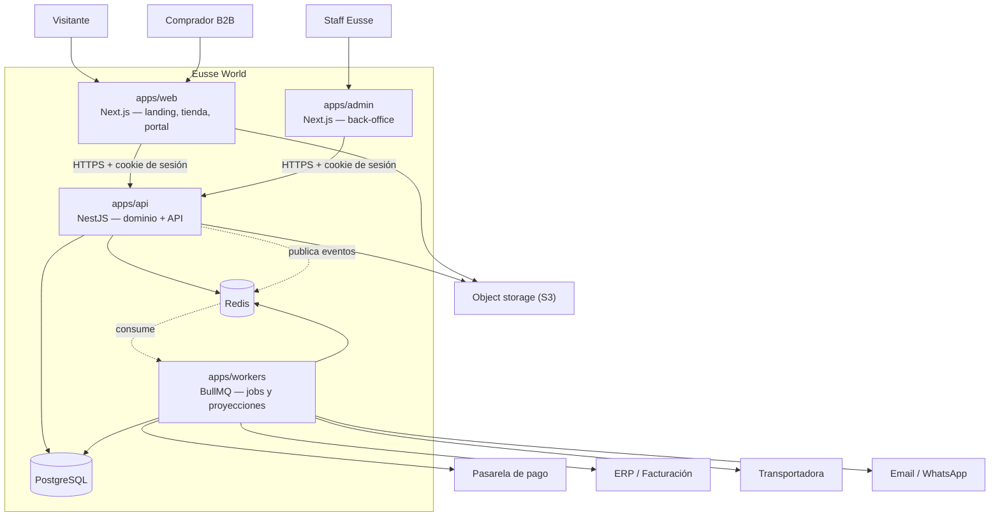
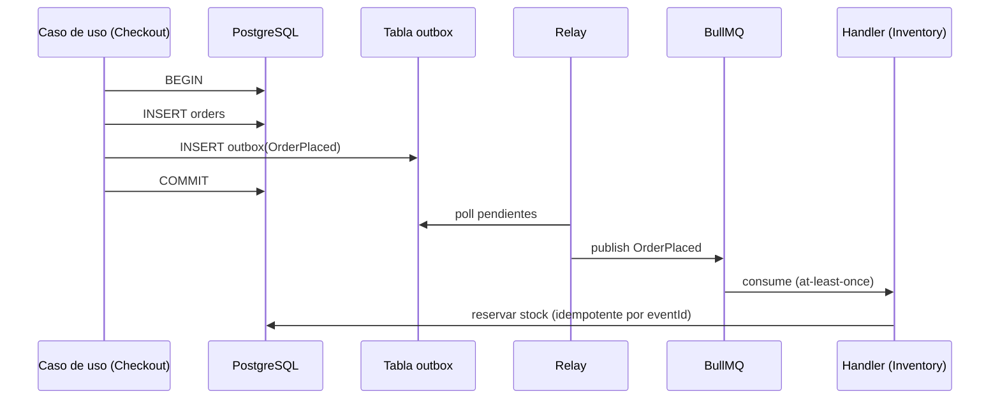
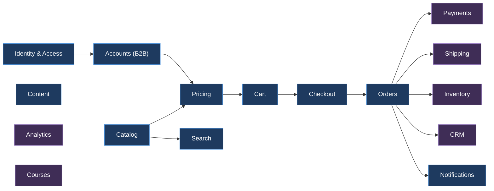
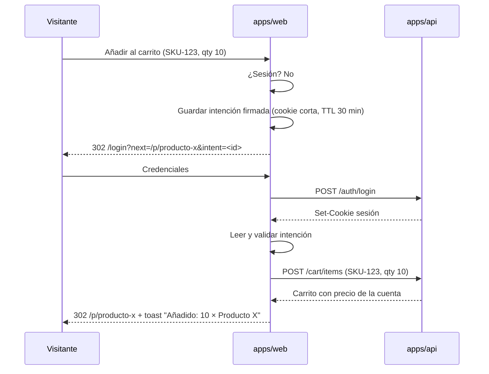

# 01 — Arquitectura

**Dueño:** Arquitecto · **Última revisión:** 2026-08-06 · **Estado:** Vigente

Este documento describe **qué es el sistema y por qué**. Las decisiones puntuales viven en
`adrs/`; este documento las integra. Si hay contradicción, gana el ADR.

---

## 1. Vista de contexto (C4 — nivel 1)



**Regla de frontera:** ninguna app de frontend habla con PostgreSQL, Redis ni con
terceros directamente. Todo pasa por `apps/api`. Sin excepciones.

---

## 2. Estilo arquitectónico

Tres decisiones definen el sistema:

### 2.1 Monolito modular, no microservicios

Un solo despliegue de API con **módulos de dominio aislados por contrato**, no por red.
Ver [ADR-0002](../adrs/ADR-0002-modular-monolith.md).

Motivo: el equipo es pequeño y el dominio B2B todavía se está descubriendo. Los
microservicios prematuros congelan fronteras equivocadas y multiplican el coste
operativo. Los módulos están tan aislados que **extraer uno a un servicio es un cambio de
transporte, no un rediseño**.

Condiciones para extraer un módulo (no antes):
- Perfil de carga radicalmente distinto al resto (ej. búsqueda, chat).
- Necesidad de escalar o desplegar por separado, demostrada con métricas.
- Un equipo dedicado que lo posea.

### 2.2 Arquitectura hexagonal + DDD táctico dentro de cada módulo

```
apps/api/src/modules/<module>/
├── domain/           # Entidades, value objects, agregados, eventos, errores, puertos.
│                     # CERO imports de framework. CERO Prisma. CERO NestJS.
│   ├── entities/
│   ├── value-objects/
│   ├── events/
│   ├── errors/
│   └── ports/        # Interfaces que el dominio necesita (repositorios, servicios)
├── application/      # Casos de uso. Orquestan dominio + puertos. Una clase por caso de uso.
│   ├── commands/
│   ├── queries/
│   └── handlers/     # Reaccionan a eventos de otros módulos
├── infrastructure/   # Adaptadores: Prisma, Redis, HTTP saliente, colas.
│   ├── persistence/
│   ├── messaging/
│   └── external/
└── interface/        # Puertos de entrada: controllers HTTP, consumers, CLI.
    ├── http/
    └── consumers/
```

**Regla de dependencia (se verifica en CI):** `interface → application → domain` y
`infrastructure → domain`. El dominio no depende de nadie. Si `domain/` importa algo de
`@nestjs/*` o `@prisma/client`, el build falla.

### 2.3 Event-driven en las costuras

Los módulos **no se llaman entre sí por métodos públicos** salvo por lecturas explícitas
declaradas. La comunicación por defecto es asíncrona vía eventos.



**Outbox transaccional obligatorio.** Un evento nunca se publica fuera de la transacción
que produjo el cambio. Ver [ADR-0014](../adrs/ADR-0014-transactional-outbox.md) y
[RFC-0013](../rfcs/RFC-0013-domain-and-integration-events.md).

**Todo consumidor es idempotente.** La entrega es *at-least-once*; se deduplica por
`eventId` en una tabla `processed_events`. Un handler que no tolera reprocesamiento es un
bug, no una limitación de la infraestructura.

---

## 3. Contextos acotados



Azul = Fase 1. Morado = Fase 2+ (interfaces definidas desde ya, implementación diferida).

| Contexto | Responsabilidad | Fase |
| -------- | --------------- | ---- |
| **Identity & Access** | Usuarios, credenciales, sesiones, roles, permisos | 1 |
| **Accounts** | Cuenta empresarial, miembros, límites, términos de pago, direcciones | 1 |
| **Catalog** | Producto, variante, SKU, categoría, atributos, medios | 1 |
| **Pricing** | Listas de precios, escalas por volumen, reglas por cuenta, impuestos | 1 |
| **Cart** | Carrito de la cuenta, líneas, recálculo, validez | 1 |
| **Checkout** | Proceso de compra, validaciones, aprobación, creación de orden | 1 |
| **Orders** | Orden, estados, histórico, recompra, documentos | 1 |
| **Content** | Contenido estructurado de landing y páginas | 1 |
| **Notifications** | Email/WhatsApp transaccional, plantillas, preferencias | 1 |
| **Search** | Indexación y consulta de catálogo | 1 |
| **Payments** | Intentos de pago, conciliación, crédito | 2 |
| **Shipping** | Métodos, tarifas, guías, tracking | 2 |
| **Inventory** | Stock, bodegas, reservas, movimientos | 2 |
| **CRM** | Contactos, oportunidades, actividades, cotizaciones | 3 |
| **Analytics** | Métricas de negocio, proyecciones de lectura | 2 |
| **Courses** | Cursos, lecciones, matrículas, progreso | 4 |

**Búsqueda:** en Fase 1 se implementa con PostgreSQL (`tsvector` + `pg_trgm`) tras el
puerto `SearchPort`. Cuando el catálogo o las facetas lo exijan, se cambia el adaptador a
Meilisearch/Typesense **sin tocar dominio ni frontend**.

---

## 4. Frontend

### 4.1 Dos aplicaciones, no una

`apps/web` (público + cliente) y `apps/admin` (staff) son apps separadas.
Ver [ADR-0004](../adrs/ADR-0004-web-admin-split.md).

Motivo: superficies de autenticación, riesgo, bundle y cadencia de despliegue muy
distintos. Un bug en el back-office no debe poder tumbar la landing. Comparten el 100%
del design system vía `@eusse/ui`.

### 4.2 Estructura de `apps/web`

```
apps/web/src/
├── app/
│   └── [locale]/
│       ├── (marketing)/        # landing, sobre nosotros, contacto — estático, ISR
│       ├── (shop)/             # catálogo, producto, carrito, checkout
│       ├── (auth)/             # login, registro, recuperación
│       ├── (account)/          # portal de cliente — protegido
│       └── api/                # BFF: sólo proxy de sesión y webhooks. Sin lógica de negocio.
├── features/                   # Vertical slices: un feature = UI + hooks + estado + tipos
│   ├── catalog/
│   ├── cart/
│   ├── checkout/
│   └── account/
├── components/                 # Composiciones específicas de esta app
├── lib/
└── styles/
```

**Regla:** un componente vive en `packages/ui` si es reutilizable y agnóstico del dominio;
en `apps/*/components` si es una composición concreta; en `features/<x>/components` si
sólo tiene sentido dentro de ese feature.

### 4.3 Server Components por defecto

- **Server Component** salvo que necesites estado, efectos o eventos del navegador.
- `"use client"` lo más abajo posible en el árbol. Una hoja interactiva no convierte a su
  página en cliente.
- Datos de catálogo y contenido: se obtienen en el servidor.
- Datos de sesión (carrito, precios de la cuenta): TanStack Query en cliente, hidratados
  desde el servidor cuando se puede.

### 4.4 Estado: tres tipos, tres herramientas

| Tipo de estado | Herramienta | Ejemplos |
| -------------- | ----------- | -------- |
| **Servidor** (remoto, cacheable, puede quedar obsoleto) | TanStack Query | catálogo, carrito, órdenes, precios |
| **Cliente global** (efímero, sólo UI) | Zustand | tema, drawer del carrito abierto, filtros activos |
| **Formulario** | React Hook Form + Zod | login, checkout, alta de producto |

**Antipatrón prohibido:** copiar datos del servidor a Zustand. Si vino de la API, lo posee
TanStack Query. Ver [ADR-0012](../adrs/ADR-0012-state-management.md).

### 4.5 Renderizado por ruta

| Ruta | Estrategia | Motivo |
| ---- | ---------- | ------ |
| Landing | Estático + ISR | Máxima velocidad y SEO |
| Categoría / listado | Estático + ISR, filtros en cliente | SEO + navegación fluida |
| Ficha de producto | Estático + ISR; **precio en cliente** | La página se cachea; el precio es por cuenta |
| Carrito / checkout | Dinámico, sin caché | Estado de sesión |
| Portal de cliente | Dinámico, sin caché | Datos privados |
| Admin | Dinámico, sin caché, `noindex` | Datos privados |

**Consecuencia crítica:** la ficha de producto **nunca** incluye el precio de la cuenta en
el HTML cacheado. El precio se pide autenticado desde el cliente. Ver
[RFC-0006](../rfcs/RFC-0006-cart-and-b2b-pricing.md).

---

## 5. Autenticación

Autenticación propia emitida por `apps/api`, transportada en **cookies httpOnly** y
gestionada por el BFF de Next.js. Ver [ADR-0008](../adrs/ADR-0008-auth-strategy.md) y
[RFC-0003](../rfcs/RFC-0003-identity-and-access.md).

- Access token JWT de vida corta (15 min) + refresh token rotatorio (30 días) con
  detección de reutilización.
- Cookies `httpOnly`, `Secure`, `SameSite=Lax`, con prefijo `__Host-`.
- **Ningún token en `localStorage`.** Nunca.
- Autorización: RBAC por rol dentro de la cuenta + comprobaciones a nivel de recurso.
  El permiso se evalúa **en el servidor**; la UI sólo oculta, no protege.

### 5.1 Flujo "añadir al carrito" sin sesión

Requisito de producto no negociable: el visitante que pulsa "Añadir al carrito" es llevado
a login y **vuelve al producto que intentaba agregar**, con la intención intacta.



Reglas:
- La intención se **valida de nuevo** tras el login: precio, disponibilidad y visibilidad
  se resuelven con la cuenta real. Si el producto no es visible para esa cuenta, se informa
  claramente y no se agrega.
- `next` se valida contra una allowlist de rutas internas. **Redirección abierta = falla de
  seguridad bloqueante.**
- La intención expira en 30 minutos y es de un solo uso.

Especificación completa: [RFC-0004](../rfcs/RFC-0004-guest-intent-auth-return.md).

---

## 6. Datos

- **PostgreSQL** como única fuente de verdad transaccional. Ver [ADR-0006](../adrs/ADR-0006-postgres-prisma.md).
- **Un esquema Prisma, múltiples esquemas de PostgreSQL** — un `schema` por contexto
  acotado (`identity`, `catalog`, `orders`, …). Impide joins accidentales entre contextos.
- **Sin claves foráneas entre contextos.** La referencia cruzada se guarda por ID y se
  resuelve por evento o por consulta explícita al módulo dueño.
- **Migraciones versionadas**, siempre hacia adelante, siempre reversibles en dos pasos
  (expand → migrate → contract). Ver [`checklists/database-migration.md`](../checklists/database-migration.md).
- **Dinero**: `numeric(18,4)` en base, entero en menor unidad en la API, nunca `float`.
  Toda cantidad monetaria lleva moneda. Ver [`docs/03-conventions.md`](03-conventions.md).
- **Redis**: caché, sesiones de rate-limit, colas BullMQ. Nunca fuente de verdad.

---

## 7. Contratos de API

**Zod es la fuente de verdad.** Un esquema Zod en `@eusse/contracts` genera:
tipos TypeScript · validación en NestJS · OpenAPI · cliente tipado en `@eusse/sdk`.
Ver [ADR-0009](../adrs/ADR-0009-zod-contracts.md) y [RFC-0012](../rfcs/RFC-0012-api-contracts.md).

- Versionado por URL: `/api/v1/...`. Los cambios rompedores suben versión.
- Respuesta de error uniforme (RFC 7807 *problem+json*) con `code` estable y legible por
  máquina. El frontend nunca hace `match` sobre mensajes en prosa.
- Toda respuesta paginada usa **cursor**, no offset.
- Todo endpoint mutador acepta `Idempotency-Key`.

---

## 8. Observabilidad

- **Logs** estructurados JSON con `correlationId` propagado desde el borde.
- **Trazas** OpenTelemetry, un span por caso de uso y por consulta a base de datos.
- **Métricas** RED (Rate, Errors, Duration) por endpoint y por handler de cola.
- **Errores** agrupados por `code` de dominio, no por stack trace.
- Toda operación de negocio relevante emite un evento de dominio: la auditoría es un
  proyector de eventos, no `console.log`.

---

## 9. Preparación para el futuro

| Necesidad futura | Qué la habilita hoy | Qué NO se construye hoy |
| ---------------- | ------------------- | ----------------------- |
| **CRM** | Eventos `OrderPlaced`, `AccountCreated`, `QuoteRequested` ya publicados; contexto CRM reservado | Pipeline, actividades, UI |
| **Inventario** | `InventoryPort` en Catalog con adaptador *always-available*; eventos de orden ya emitidos | Bodegas, reservas, conteos |
| **Cursos** | Contexto `Courses` reservado; Identity ya soporta usuarios sin cuenta B2B | Modelo LMS, reproductor |
| **App móvil** | API pública versionada + `@eusse/contracts` + `@eusse/sdk` agnósticos de plataforma | Cliente Expo, push |
| **Multi-marca** | `tenantId` presente en el modelo desde el día 1, con un único tenant activo | Resolución por dominio, aislamiento |

**Regla:** se paga el coste de *dejar el hueco* (puerto, evento, columna), nunca el de
*construir la habitación* antes de necesitarla.

---

## 10. Lo que esta arquitectura prohíbe explícitamente

1. Lógica de negocio en componentes de React o en Route Handlers de Next.
2. Prisma importado fuera de `infrastructure/`.
3. Un módulo importando `domain/` o `infrastructure/` de otro módulo.
4. Llamadas directas desde el navegador a servicios de terceros con secretos.
5. Precios calculados en el cliente.
6. Tokens de sesión en `localStorage` o `sessionStorage`.
7. Migraciones que borran columnas en el mismo despliegue que deja de usarlas.
8. Eventos publicados fuera de la transacción que los originó.
9. `any` en código de producción sin `// @ts-expect-error` justificado y con enlace a issue.
10. Un componente de `packages/ui` que importe algo del dominio.

## Enlaces

- Dominio → [02-domain-model.md](02-domain-model.md)
- Dependencias → [07-module-dependencies.md](07-module-dependencies.md)
- Escalabilidad → [09-scalability.md](09-scalability.md)
- Riesgos → [08-technical-risks.md](08-technical-risks.md)
