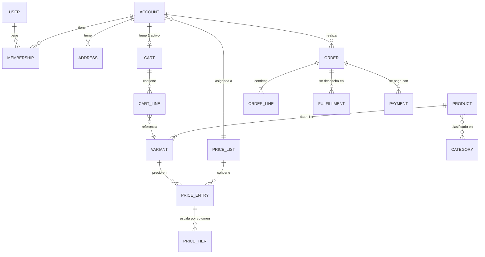
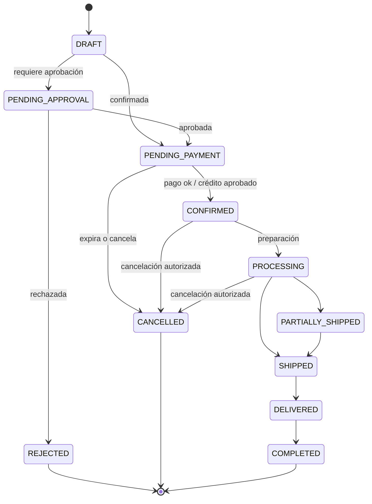

# 02 — Modelo de dominio

**Dueño:** Arquitecto + Analista Funcional · **Última revisión:** 2026-08-06 · **Estado:** Vigente

Modelo de alto nivel. El detalle por contexto se especifica en su RFC y se documenta en
`docs/domain/<contexto>.md` una vez aprobado.

---

## 1. Lenguaje ubicuo

Términos con significado preciso. Usar otro nombre para lo mismo es un defecto.
Glosario completo ES↔EN: [13-glossary.md](13-glossary.md).

| Término                | Significado exacto                                                    | No confundir con |
| ---------------------- | --------------------------------------------------------------------- | ---------------- |
| **Account** (Cuenta)   | La empresa cliente. Es quien compra, quien tiene precios y crédito.   | User             |
| **User** (Usuario)     | Persona con credenciales. Puede pertenecer a varias cuentas.          | Account          |
| **Membership**         | Vínculo User↔Account con un rol. Define qué puede hacer y por cuánto. | Role             |
| **Product**            | Concepto comercial ("Taladro X"). No se vende directamente.           | Variant          |
| **Variant / SKU**      | Unidad vendible con su propio código, precio y stock.                 | Product          |
| **PriceList**          | Conjunto de precios aplicable a una o más cuentas.                    | Discount         |
| **PriceTier**          | Escala por cantidad dentro de una lista (1–9, 10–49, 50+).            | Promotion        |
| **Cart**               | Carrito **de la cuenta**, no del usuario. Persistente en servidor.    | Sesión           |
| **CartLine**           | Línea con SKU, cantidad y **precio congelado con su timestamp**.      | OrderLine        |
| **Order**              | Compromiso de compra confirmado. Inmutable en sus líneas.             | Cart             |
| **PurchaseOrder (PO)** | Referencia del **cliente** para su contabilidad. Un texto.            | Order            |
| **Quote**              | Cotización con vigencia, convertible en Order.                        | Cart             |
| **Fulfillment**        | Envío físico de parte o toda una orden.                               | Order            |

---

## 2. Agregados y raíces

Un agregado = una frontera transaccional = una raíz por la que se accede.
**Regla: una transacción modifica un solo agregado.** Lo demás se coordina por eventos.

| Agregado      | Raíz        | Invariantes que protege                                                                                            |
| ------------- | ----------- | ------------------------------------------------------------------------------------------------------------------ |
| **Account**   | `Account`   | Al menos un miembro con rol `OWNER`. Límite de crédito ≥ 0. Un solo `taxId` por tenant.                            |
| **User**      | `User`      | Email único. Credencial válida o cuenta bloqueada.                                                                 |
| **Product**   | `Product`   | Al menos una variante. Slug único. Una variante por combinación de atributos.                                      |
| **PriceList** | `PriceList` | Escalas sin solape ni hueco. Moneda única por lista. Vigencia coherente.                                           |
| **Cart**      | `Cart`      | Un carrito activo por cuenta. Cantidad ≥ mínimo de venta y múltiplo del incremento. Sin líneas duplicadas por SKU. |
| **Order**     | `Order`     | Líneas inmutables. Total = Σ líneas + impuestos + envío − descuentos. Transición de estado válida.                 |
| **Quote**     | `Quote`     | Vigencia futura al emitir. No convertible tras expirar.                                                            |

---

## 3. Reglas de dominio críticas (Fase 1)

Estas reglas se implementan **en `domain/`**, con test unitario cada una. No en el
controller, no en el componente.

### Precio

| ID     | Regla                                                                                                                                  |
| ------ | -------------------------------------------------------------------------------------------------------------------------------------- |
| PRC-01 | El precio de un SKU depende de: cuenta → lista de precios → escala por cantidad → moneda. En ese orden.                                |
| PRC-02 | Sin sesión no hay precio de cuenta. Se muestra "Inicia sesión para ver tu precio" o precio de lista pública si el catálogo lo permite. |
| PRC-03 | El precio se **congela** en la línea de carrito con su `pricedAt`.                                                                     |
| PRC-04 | Una línea con precio de más de 24 h se revalida antes del checkout; si cambió, se informa y se requiere confirmación explícita.        |
| PRC-05 | El precio nunca se calcula ni se compone en el cliente. La API devuelve el precio final por línea.                                     |
| PRC-06 | Todo importe lleva moneda. Sumar importes de monedas distintas es un error de dominio, no un redondeo.                                 |

### Carrito

| ID     | Regla                                                                                                        |
| ------ | ------------------------------------------------------------------------------------------------------------ |
| CRT-01 | El carrito pertenece a la **cuenta**. Dos compradores de la misma empresa ven el mismo carrito.              |
| CRT-02 | La cantidad debe respetar `minOrderQty` y ser múltiplo de `qtyIncrement` del SKU.                            |
| CRT-03 | Añadir un SKU ya presente **suma** cantidad, no duplica la línea.                                            |
| CRT-04 | Un SKU que deja de ser visible para la cuenta se marca `unavailable` en el carrito; no se borra en silencio. |
| CRT-05 | El carrito no reserva stock. La reserva ocurre al confirmar la orden.                                        |

### Checkout y orden

| ID     | Regla                                                                                                       |
| ------ | ----------------------------------------------------------------------------------------------------------- |
| CHK-01 | Requiere sesión, cuenta activa y al menos un miembro con permiso `order:create`.                            |
| CHK-02 | Si el total supera el `approvalThreshold` del comprador, la orden nace en `PENDING_APPROVAL` y no se cursa. |
| CHK-03 | Pago a crédito requiere `creditAvailable ≥ total`, evaluado en el servidor en el momento de confirmar.      |
| CHK-04 | Confirmar es **idempotente** por `Idempotency-Key`. Un doble clic no genera dos órdenes.                    |
| CHK-05 | Una orden confirmada no cambia sus líneas. Corregir = nota de crédito o nueva orden.                        |
| CHK-06 | Se exige mínimo de pedido por cuenta (`minOrderAmount`) si está configurado.                                |

### Identidad

| ID     | Regla                                                                                            |
| ------ | ------------------------------------------------------------------------------------------------ |
| IDN-01 | Un usuario puede pertenecer a varias cuentas; opera siempre en **una cuenta activa**.            |
| IDN-02 | Cambiar de cuenta activa cambia carrito, precios y permisos. Es un cambio de contexto completo.  |
| IDN-03 | El permiso se evalúa en el servidor por cada operación. La UI oculta, no autoriza.               |
| IDN-04 | Un registro nuevo queda `PENDING_VERIFICATION` hasta que el staff aprueba la cuenta empresarial. |

---

## 4. Máquinas de estado

Toda transición no listada es un error de dominio (`InvalidStateTransition`).

### Order

### Account

`PENDING_VERIFICATION → ACTIVE → SUSPENDED → ACTIVE` · `* → CLOSED`
Sólo `ACTIVE` puede comprar.

### Cart

`ACTIVE → CHECKING_OUT → CONVERTED` · `CHECKING_OUT → ACTIVE` (vuelta atrás) ·
`ACTIVE → ABANDONED` (por inactividad, job programado)

### Payment (Fase 2)

`INITIATED → AUTHORIZED → CAPTURED → SETTLED` · `* → FAILED` · `CAPTURED → REFUNDED`

---

## 5. Eventos de dominio

Nomenclatura: `<Contexto>.<Agregado><VerboEnPasado>` · versión explícita ·
payload plano y estable.

| Evento                           | Emisor      | Consumidores (fase)                                            |
| -------------------------------- | ----------- | -------------------------------------------------------------- |
| `identity.UserRegistered.v1`     | Identity    | Notifications, CRM(3)                                          |
| `accounts.AccountApproved.v1`    | Accounts    | Notifications, Pricing, CRM(3)                                 |
| `catalog.ProductPublished.v1`    | Catalog     | Search, Analytics(2)                                           |
| `catalog.VariantPriceChanged.v1` | Pricing     | Cart, Notifications                                            |
| `cart.ItemAdded.v1`              | Cart        | Analytics(2)                                                   |
| `cart.CartAbandoned.v1`          | Cart        | Notifications, CRM(3)                                          |
| `orders.OrderPlaced.v1`          | Orders      | Inventory(2), Payments(2), Notifications, CRM(3), Analytics(2) |
| `orders.OrderApproved.v1`        | Orders      | Notifications                                                  |
| `orders.OrderCancelled.v1`       | Orders      | Inventory(2), Payments(2), Notifications                       |
| `orders.OrderShipped.v1`         | Orders      | Notifications, Tracking(2)                                     |
| `payments.PaymentCaptured.v1`    | Payments(2) | Orders, Notifications                                          |

Contrato completo y política de versionado: [RFC-0013](../rfcs/RFC-0013-domain-and-integration-events.md).

---

## 6. Catálogo de errores de dominio

Todo error de dominio tiene código estable `<CONTEXT>_<CASE>`, mapeo HTTP fijo y mensaje
localizable. El frontend reacciona al `code`, jamás al texto.

| Código                         | HTTP | Cuándo                                 |
| ------------------------------ | ---- | -------------------------------------- |
| `AUTH_INVALID_CREDENTIALS`     | 401  | Login incorrecto                       |
| `AUTH_SESSION_EXPIRED`         | 401  | Access y refresh vencidos              |
| `AUTH_FORBIDDEN`               | 403  | Sin permiso para la operación          |
| `ACCOUNT_NOT_ACTIVE`           | 403  | Cuenta pendiente, suspendida o cerrada |
| `ACCOUNT_CREDIT_EXCEEDED`      | 422  | Crédito insuficiente                   |
| `CATALOG_VARIANT_NOT_FOUND`    | 404  | SKU inexistente                        |
| `CATALOG_VARIANT_NOT_VISIBLE`  | 403  | Existe pero no para esta cuenta        |
| `PRICING_NO_PRICE_FOR_ACCOUNT` | 422  | Sin lista de precios aplicable         |
| `PRICING_PRICE_CHANGED`        | 409  | El precio cambió durante el checkout   |
| `CART_QTY_BELOW_MINIMUM`       | 422  | Cantidad < `minOrderQty`               |
| `CART_QTY_NOT_MULTIPLE`        | 422  | Cantidad no múltiplo de `qtyIncrement` |
| `CART_EMPTY`                   | 422  | Checkout sin líneas                    |
| `CHECKOUT_APPROVAL_REQUIRED`   | 202  | Orden creada en `PENDING_APPROVAL`     |
| `ORDER_INVALID_TRANSITION`     | 409  | Transición de estado no permitida      |
| `COMMON_VALIDATION_FAILED`     | 400  | Falla de esquema Zod                   |
| `COMMON_IDEMPOTENCY_CONFLICT`  | 409  | Misma clave, payload distinto          |
| `COMMON_RATE_LIMITED`          | 429  | Límite de peticiones                   |

Formato de respuesta y catálogo completo: [RFC-0012](../rfcs/RFC-0012-api-contracts.md).

---

## 7. Cómo se documenta un contexto nuevo

Antes de implementar, el agente de dominio produce `docs/domain/<contexto>.md` con:

1. Propósito y frontera (qué **no** hace).
2. Lenguaje ubicuo del contexto.
3. Agregados, entidades, value objects e invariantes.
4. Casos de uso (comandos y consultas), uno por uno.
5. Máquinas de estado.
6. Eventos que emite y consume.
7. Errores de dominio.
8. Puertos que necesita.
9. Modelo de persistencia y su mapeo.
10. Qué se difiere a fases posteriores y qué hueco se deja.

Plantilla: [`templates/domain-model.md`](../templates/domain-model.md).
