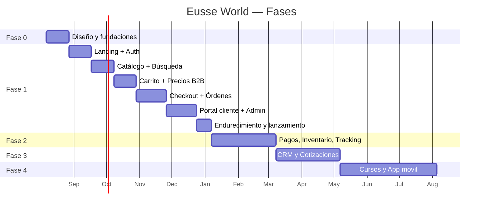

# 05 — Roadmap

**Dueño:** Product Owner + Arquitecto · **Última revisión:** 2026-08-06 · **Estado:** Vigente

Fases por **capacidad entregada**, no por fecha. Una fase termina cuando su criterio de
salida se cumple, no cuando se agota el calendario.

---

## Fase 0 — Diseño y fundaciones

**Objetivo:** que cualquier agente pueda implementar sin preguntar nada.

| Entregable                                                           | Estado         |
| -------------------------------------------------------------------- | -------------- |
| Estructura del repositorio                                           | ✅ este commit |
| 30 agentes especificados                                             | ✅             |
| Skills por dominio                                                   | ✅             |
| RFC-0001 … RFC-0015                                                  | ✅ borradores  |
| ADR-0001 … ADR-0020                                                  | ✅             |
| Checklists y plantillas                                              | ✅             |
| Convenciones y estándares                                            | ✅             |
| Roadmap y plan de ejecución                                          | ✅             |
| Monorepo funcional (Turborepo, pnpm, tsconfig, ESLint, Prettier, CI) | ⏳ Sprint 0    |
| Docker Compose (PostgreSQL + Redis)                                  | ⏳ Sprint 0    |
| `@eusse/tokens` y esqueleto de `@eusse/ui`                           | ⏳ Sprint 0    |
| Apps arrancando con "hello world" y CI en verde                      | ⏳ Sprint 0    |

**Criterio de salida:** `pnpm install && pnpm dev` levanta las cuatro apps; CI verde;
RFC-0001 a RFC-0004 aprobados.

---

## Fase 1 — Plataforma comercial

Landing · Auth · Ecommerce B2B · Portal de cliente · Back-office.

### Hito 1.1 — Cimientos visibles

Design system base · Landing completa · i18n · Dark mode · SEO técnico.
**Salida:** landing en producción, Lighthouse ≥ 95, dos idiomas.

### Hito 1.2 — Identidad

Registro · Login · Refresh · Recuperación · Roles · Cuenta activa · Aprobación de cuentas.
**Salida:** un comprador entra, ve su cuenta y cambia entre cuentas.

### Hito 1.3 — Catálogo

Producto, variante, categoría, atributos, medios · Búsqueda y facetas · Ficha de producto ·
Visibilidad por cuenta · Admin de catálogo.
**Salida:** catálogo real navegable, indexado y administrable.

### Hito 1.4 — Precios y carrito

Listas de precios, escalas por volumen · Carrito de cuenta · **Flujo invitado → login →
retorno al producto** ([RFC-0004](../rfcs/RFC-0004-guest-intent-auth-return.md)).
**Salida:** el comprador ve su precio real y arma un carrito de 40 líneas sin fricción.

### Hito 1.5 — Checkout y órdenes

Checkout multi-paso · Aprobación por umbral · Orden de compra del cliente ·
Órdenes y estados · Recompra desde histórico · Notificaciones transaccionales.
**Salida:** primer pedido real cursado de punta a punta.

### Hito 1.6 — Portal y back-office

Portal de cliente (órdenes, usuarios, direcciones, documentos) ·
Admin (cuentas, productos, precios, órdenes, contenido, usuarios) · Auditoría.
**Salida:** el equipo comercial opera sin tocar la base de datos.

### Hito 1.7 — Endurecimiento

Auditoría de seguridad · Rendimiento · Accesibilidad AA verificada · Carga ·
Runbooks · Observabilidad · Plan de reversión.
**Salida:** producción con clientes reales.

**Criterio de salida de la Fase 1:** un cliente B2B completa registro → aprobación →
compra → seguimiento sin intervención humana, y el back-office gestiona todo el ciclo.

---

## Fase 2 — Operación

Pagos en línea y conciliación · Crédito y cartera · Inventario multi-bodega con reservas ·
Envíos y tracking · Analítica de negocio.

**Se habilita porque:** en Fase 1 ya existen `PaymentPort`, `InventoryPort`,
`ShippingPort` con adaptadores triviales, y los eventos de orden ya se publican.

**Criterio de salida:** pago en línea funcionando, stock real reflejado en catálogo,
cliente rastreando su envío.

---

## Fase 3 — Comercial

CRM (contactos, oportunidades, actividades) · Cotizaciones (RFQ → Quote → Order) ·
Segmentación y campañas · Chat en vivo con contexto de cuenta.

**Se habilita porque:** los eventos de identidad, cuenta y órdenes ya alimentan un
contexto CRM desde la Fase 1.

---

## Fase 4 — Expansión

Cursos y certificaciones (LMS) · App móvil (Expo, misma API y contratos) ·
Portal de distribuidores · Multi-marca.

**Se habilita porque:** la API es pública, versionada y tipada; `@eusse/contracts` y
`@eusse/sdk` no dependen de la plataforma; `tenantId` existe desde el día 1.

---

## Qué NO se hará (y por qué)

| Idea                                 | Motivo                                                                                                 |
| ------------------------------------ | ------------------------------------------------------------------------------------------------------ |
| Microservicios en Fase 1             | Coste operativo sin beneficio; las fronteras aún se están descubriendo                                 |
| GraphQL                              | Un solo consumidor principal; REST tipado con Zod cubre el caso con menos maquinaria                   |
| CMS headless externo                 | El contenido de la landing es acotado y estructurado; un CMS añade latencia, coste y un punto de fallo |
| Micro-frontends                      | Un equipo, dos apps. No hay problema que resolver                                                      |
| Motor de búsqueda dedicado en Fase 1 | PostgreSQL FTS basta hasta ~50k SKUs; el puerto permite cambiarlo después                              |
| Kubernetes en Fase 1                 | Contenedores en un PaaS gestionado. K8s cuando haya equipo que lo opere                                |
