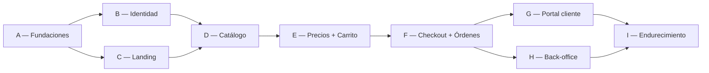

# 06 — Orden exacto de implementación

**Dueño:** Arquitecto · **Última revisión:** 2026-08-06 · **Estado:** Vigente

Secuencia estricta. Cada paso declara **entrada**, **salida**, **agente responsable** y
**qué desbloquea**. Un paso no empieza si su entrada no está verde.

**Regla transversal:** dentro de cualquier feature, el orden interno siempre es
`Contratos → Dominio → Aplicación → Infraestructura → HTTP → SDK → UI → E2E`.

---

## Bloque A — Fundaciones (secuencial, sin paralelizar)

| # | Paso | Agente | Salida | Desbloquea |
| - | ---- | ------ | ------ | ---------- |
| A1 | Monorepo: pnpm workspaces, `turbo.json`, `.npmrc`, `.nvmrc` | DevOps | `pnpm install` funciona | todo |
| A2 | `@eusse/config-typescript`, `-eslint`, `-tailwind`; Prettier; commitlint; husky | DevOps | `pnpm lint`/`typecheck` en repo vacío | todo |
| A3 | Docker Compose: PostgreSQL 16, Redis 7, MailHog, MinIO | DevOps | `docker compose up` | A5, A6 |
| A4 | CI en GitHub Actions: install → lint → typecheck → test → build, con caché | DevOps | CI verde | merges |
| A5 | `apps/api`: NestJS, config validada por Zod, health, logger, OpenTelemetry, filtro de errores, `correlationId` | Backend | `GET /health` 200 | todo backend |
| A6 | Prisma: conexión, esquemas por contexto, migración inicial vacía, seed | Base de Datos | `prisma migrate dev` | todo modelo |
| A7 | `@eusse/contracts`: base Zod, envoltorio de error, paginación, `Money`, IDs de marca | Backend + Frontend | paquete publicable | todo contrato |
| A8 | `@eusse/tokens`: color, tipografía, espaciado, radio, sombra, movimiento; light/dark | Design System | `@theme` de Tailwind v4 | toda UI |
| A9 | `@eusse/ui`: primitivos (Button, Input, Card, Dialog, Sheet, Tooltip, Toast, Skeleton) sobre Radix + CVA | UI + Design System | Storybook | toda UI |
| A10 | `apps/web`: Next 15, App Router, `[locale]`, next-intl, tema, layout base, error/loading/not-found | Frontend | landing "hello" en es/en | toda UI |
| A11 | `apps/admin`: idéntico esqueleto, `noindex`, layout de back-office | Frontend | admin "hello" | admin |
| A12 | `apps/workers`: NestJS standalone, BullMQ, worker de prueba, retry y DLQ | Backend + DevOps | job procesado | eventos |
| A13 | Outbox: tabla, relay, publicador, deduplicación (`processed_events`) | Backend | evento de prueba end-to-end | todos los eventos |
| A14 | `@eusse/testing`: setup de Vitest, Testcontainers, fábricas, matchers | Testing | `pnpm test` en verde | todo test |
| A15 | Playwright: config, fixtures de auth, axe, snapshots visuales | Testing | E2E de humo | todo E2E |

**Puerta A:** las cuatro apps arrancan, CI verde, un evento fluye de API a worker.
Nadie pasa al Bloque B antes.

---

## Bloque B — Identidad (crítico: todo depende de esto)

**Requiere:** Puerta A · **RFC-0003** aprobado

| # | Paso | Agente | Salida |
| - | ---- | ------ | ------ |
| B1 | Contratos: `auth.contract.ts`, `account.contract.ts`, `user.contract.ts` | Backend + Frontend | esquemas Zod |
| B2 | Dominio Identity: `User`, `Credential`, `Session`, `RefreshToken`, errores | Backend | tests unitarios verdes |
| B3 | Dominio Accounts: `Account`, `Membership`, `Role`, `Permission`, `Address` | Backend | tests unitarios verdes |
| B4 | Casos de uso: registro, login, refresh, logout, recuperación, cambiar cuenta activa | Auth | tests de integración |
| B5 | Persistencia + migraciones del esquema `identity` | Base de Datos | migración aplicada |
| B6 | HTTP: `/auth/*`, `/me`, `/accounts/*`; guards, rate limiting, cookies httpOnly | Auth + Seguridad | endpoints probados |
| B7 | `@eusse/auth` + BFF en Next: helpers de sesión, middleware, protección de rutas | Auth + Frontend | ruta protegida |
| B8 | UI: login, registro, recuperación, verificación, selector de cuenta | UI + UX | pantallas accesibles |
| B9 | E2E: registro → aprobación → login → refresh → logout | Testing | recorrido verde |
| B10 | Revisión de seguridad de identidad | Seguridad | informe sin hallazgos altos |

**Puerta B:** un usuario se autentica, la sesión se renueva sola y las rutas protegidas
lo están **en el servidor**.

---

## Bloque C — Landing (paralelizable con B)

**Requiere:** A8, A9, A10 · **RFC-0009** aprobado

| # | Paso | Agente |
| - | ---- | ------ |
| C1 | Sistema visual: paleta, tipografía, escala, movimiento, superficies de vidrio | Design System + UI |
| C2 | Componentes de marketing: Hero, FeatureGrid, Stats, Testimonials, Logos, CTA, FAQ, Footer | UI |
| C3 | Movimiento: revelado al scroll, parallax sutil, microinteracciones, `prefers-reduced-motion` | UI + UX |
| C4 | Contenido estructurado + i18n es/en | Internacionalización + Documentación |
| C5 | SEO: metadatos, OpenGraph, JSON-LD `Organization`, sitemap, robots, canónicas | SEO |
| C6 | Rendimiento: imágenes, fuentes, presupuesto, Lighthouse ≥ 95 | Performance |
| C7 | Accesibilidad AA verificada con teclado y lector de pantalla | Accesibilidad |
| C8 | Formulario de contacto → lead + notificación | Frontend + Backend |

**Puerta C:** landing en producción, Lighthouse ≥ 95 en las cuatro categorías, AA
verificada.

---

## Bloque D — Catálogo

**Requiere:** Puerta B · **RFC-0005** aprobado

| # | Paso | Agente |
| - | ---- | ------ |
| D1 | Contratos de producto, variante, categoría, atributo, medio, búsqueda | Productos |
| D2 | Dominio Catalog: agregado `Product`, `Variant`, invariantes, visibilidad | Productos |
| D3 | Persistencia + migraciones del esquema `catalog` | Base de Datos |
| D4 | `SearchPort` + adaptador PostgreSQL (`tsvector`, `pg_trgm`, facetas) | Catálogo |
| D5 | Casos de uso: listar, buscar, facetar, detalle, relacionados | Catálogo |
| D6 | HTTP público + `@eusse/sdk` con hooks de TanStack Query | Backend + Frontend |
| D7 | UI listado: grid, filtros, orden, paginación, estados vacíos, skeletons | UI |
| D8 | UI ficha: galería, variantes, atributos, ficha técnica, **zona de precio** | UI + UX |
| D9 | Admin de catálogo: CRUD, carga de medios, publicación, importación CSV | Dashboard Admin |
| D10 | SEO de producto: JSON-LD `Product`, canónicas, sitemap dinámico | SEO |
| D11 | Índices, `EXPLAIN` de las consultas de listado, caché | Performance + Base de Datos |
| D12 | E2E: buscar → filtrar → abrir producto | Testing |

**Puerta D:** catálogo real navegable en < 2.5 s LCP, administrable e indexado.

---

## Bloque E — Precios y carrito

**Requiere:** Puerta D · **RFC-0006** aprobado

| # | Paso | Agente |
| - | ---- | ------ |
| E1 | Contratos de lista de precios, escala, precio resuelto, carrito, línea | Ecommerce |
| E2 | Dominio Pricing: `PriceList`, `PriceEntry`, `PriceTier`, resolución, `Money` | Ecommerce |
| E3 | Dominio Cart: `Cart`, `CartLine`, invariantes CRT-01…05, congelado de precio | Carrito |
| E4 | Persistencia + migraciones de `pricing` y `cart` | Base de Datos |
| E5 | Casos de uso: resolver precio, añadir, actualizar, eliminar, vaciar, revalidar | Carrito |
| E6 | HTTP + SDK, con optimistic updates y reconciliación | Backend + Frontend |
| E7 | **Intención de invitado**: firmar, guardar, redirigir, validar, consumir ([RFC-0004](../rfcs/RFC-0004-guest-intent-auth-return.md)) | Auth + Carrito |
| E8 | UI: zona de precio, selector de cantidad con múltiplos, drawer de carrito, página de carrito | UI + UX |
| E9 | Admin de precios: listas, escalas, asignación a cuentas, importación | Dashboard Admin |
| E10 | E2E: **invitado añade → login → vuelve al producto → carrito con su precio** | Testing |
| E11 | Revisión de seguridad: redirección abierta, manipulación de precio, IDOR de carrito | Seguridad |

**Puerta E:** el flujo invitado→login→retorno funciona exactamente como especifica el
RFC-0004, y ningún precio se calcula en el cliente.

---

## Bloque F — Checkout y órdenes

**Requiere:** Puerta E · **RFC-0007** aprobado

| # | Paso | Agente |
| - | ---- | ------ |
| F1 | Contratos de checkout, orden, línea, dirección, método de pago | Checkout |
| F2 | Dominio Orders: agregado `Order`, máquina de estados, numeración, totales | Checkout |
| F3 | Dominio Checkout: validaciones, umbral de aprobación, crédito | Checkout |
| F4 | `PaymentPort` + adaptador *offline* (transferencia/crédito) | Pagos |
| F5 | `InventoryPort` + adaptador *always-available* | Backend |
| F6 | `ShippingPort` + adaptador de tarifa plana | Tracking |
| F7 | Persistencia + migraciones de `orders`; idempotencia | Base de Datos |
| F8 | Casos de uso: iniciar, validar, confirmar (idempotente), aprobar, rechazar, cancelar | Checkout |
| F9 | Eventos `OrderPlaced`, `OrderApproved`, `OrderCancelled` vía outbox | Backend |
| F10 | Notificaciones: plantillas, email transaccional, consumidores | Backend + Documentación |
| F11 | UI checkout multi-paso con recuperación de error y revalidación de precio | UI + UX |
| F12 | UI de confirmación y detalle de orden | UI |
| F13 | Admin de órdenes: listado, detalle, cambio de estado, aprobación, documentos | Dashboard Admin |
| F14 | E2E: carrito → checkout → orden → aprobación → estado | Testing |
| F15 | Pruebas de idempotencia y concurrencia (doble submit, doble clic, reintento) | QA |

**Puerta F:** una orden real se cursa, notifica y aparece en el admin. Doble clic no
duplica.

---

## Bloque G — Portal de cliente

**Requiere:** Puerta F · **RFC-0010** aprobado

G1 Contratos · G2 Casos de uso de lectura (órdenes, documentos, cuenta) ·
G3 **Recompra** desde orden previa · G4 Gestión de usuarios de la cuenta ·
G5 Direcciones · G6 Perfil y preferencias · G7 Panel con métricas propias ·
G8 UI completa con estados · G9 E2E de recompra en < 90 s.

**Puerta G:** un comprador repite un pedido anterior en menos de 90 segundos.

---

## Bloque H — Back-office

**Requiere:** Puerta F · **RFC-0011** aprobado

H1 Layout, navegación y permisos por rol · H2 Cuentas: aprobación, límites, listas ·
H3 Usuarios y roles · H4 Catálogo (viene de D9) · H5 Precios (viene de E9) ·
H6 Órdenes (viene de F13) · H7 Contenido de la landing · H8 Auditoría y actividad ·
H9 Tablas con filtros, orden, selección múltiple y exportación · H10 E2E de gestión.

**Puerta H:** el equipo comercial opera el negocio completo sin acceso a la base de datos.

---

## Bloque I — Endurecimiento

I1 Auditoría de seguridad completa · I2 Carga y estrés · I3 Rendimiento con datos reales ·
I4 Accesibilidad AA verificada por auditoría externa · I5 Observabilidad, alertas y
runbooks · I6 Recuperación ante desastres probada · I7 Documentación de operación ·
I8 Reversión probada · I9 Prueba piloto con clientes reales.

**Puerta I:** lanzamiento.

---

## Qué se puede paralelizar

- **B y C en paralelo** (equipos distintos: backend/auth vs. UI/marketing).
- **G y H en paralelo** tras la Puerta F.
- Dentro de cada bloque, contratos primero; después backend y frontend en paralelo.
- **A no se paraleliza.** Es el cimiento; hacerlo mal cuesta el proyecto entero.
