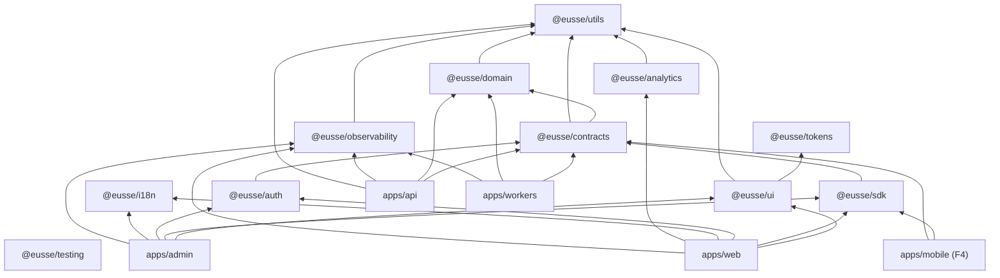
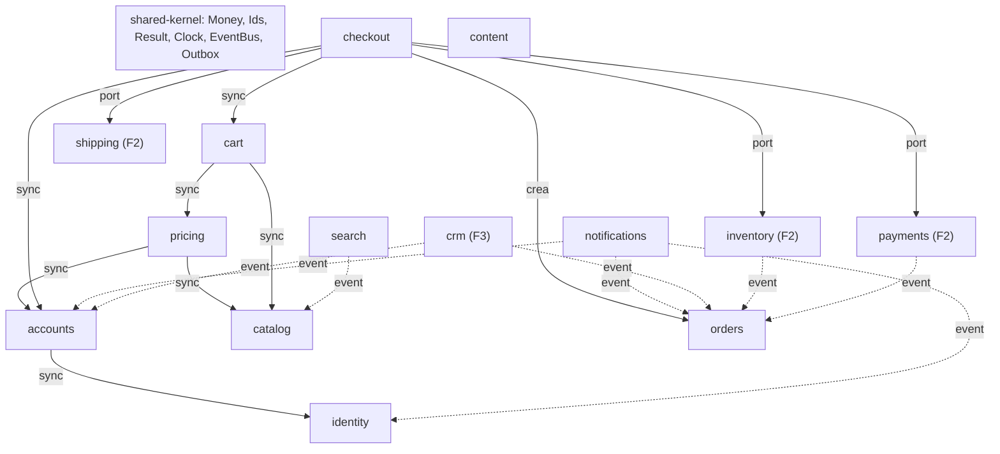

# 07 — Dependencias entre módulos

**Dueño:** Arquitecto · **Última revisión:** 2026-08-06 · **Estado:** Vigente

Este grafo es **normativo**. Se verifica en CI (`eslint-plugin-boundaries` +
`turbo` + `dependency-cruiser`). Una dependencia no listada aquí es un error de build.

---

## 1. Paquetes del monorepo



### Reglas duras

| Regla | Motivo |
| ----- | ------ |
| `@eusse/ui` **no** importa `@eusse/domain`, `@eusse/sdk` ni `@eusse/contracts` | Un botón no sabe qué es una orden. Si lo supiera, no sería reutilizable. |
| `@eusse/ui` **no** importa nada de `apps/*` | Un paquete no depende de sus consumidores. |
| `@eusse/contracts` **no** importa NestJS, React ni Prisma | Es el único punto de encuentro entre back y front. Debe ser neutral. |
| `@eusse/domain` **no** tiene dependencias de runtime salvo `@eusse/utils` | Tipos y reglas puras, compartibles con móvil. |
| `@eusse/sdk` **no** importa React como dependencia dura | Núcleo agnóstico + capa opcional de hooks. Móvil lo reutiliza. |
| `apps/*` **no** se importan entre sí | Son despliegues independientes. Lo común sube a `packages/`. |
| `@eusse/tokens` **no** importa nada | Es la hoja del grafo. |

**Sin ciclos.** Cero. `dependency-cruiser` rompe el build ante cualquier ciclo.

---

## 2. Módulos de `apps/api`



Flecha continua = dependencia **síncrona permitida** (llamada al puerto público del otro
módulo). Flecha punteada = **sólo por evento**, sin acoplamiento en tiempo de compilación.

### Cómo se permite una dependencia síncrona

Un módulo **sólo** puede consumir el `public/` de otro:

```
modules/pricing/
├── public/                    # ← lo único que otros módulos pueden importar
│   ├── pricing.facade.ts      # interfaz mínima y estable
│   └── pricing.types.ts       # DTOs, no entidades de dominio
├── domain/                    # ← privado
├── application/               # ← privado
└── infrastructure/            # ← privado
```

| Permitido | Prohibido |
| --------- | --------- |
| `import { PricingFacade } from '@modules/pricing/public'` | `import { PriceList } from '@modules/pricing/domain/entities/price-list.entity'` |
| Recibir DTOs planos | Recibir o mutar entidades de otro módulo |
| Llamada de sólo lectura | Escribir en las tablas de otro módulo |

**Cero dependencias circulares entre módulos.** Si A necesita B y B necesita A, uno de los
dos publica un evento. Sin excepciones.

### Matriz de dependencias permitidas (Fase 1)

| ↓ depende de → | identity | accounts | catalog | pricing | cart | checkout | orders |
| -------------- | :------: | :------: | :-----: | :-----: | :--: | :------: | :----: |
| **identity**   | —        | ✗        | ✗       | ✗       | ✗    | ✗        | ✗      |
| **accounts**   | ✓        | —        | ✗       | ✗       | ✗    | ✗        | ✗      |
| **catalog**    | ✗        | ✓ (visibilidad) | — | ✗   | ✗    | ✗        | ✗      |
| **pricing**    | ✗        | ✓        | ✓       | —       | ✗    | ✗        | ✗      |
| **cart**       | ✗        | ✓        | ✓       | ✓       | —    | ✗        | ✗      |
| **checkout**   | ✗        | ✓        | ✓       | ✓       | ✓    | —        | ✓      |
| **orders**     | ✗        | ✓        | ✗       | ✗       | ✗    | ✗        | —      |

Las celdas vacías se resuelven **por evento** o no existen.

---

## 3. Dependencias del frontend

```
apps/web/src/
├── app/          → features, components, lib          (composición y rutas)
├── features/     → packages, lib, sus propios componentes
│                   ✗ NUNCA otro feature
├── components/   → packages/ui, lib                   (composiciones de esta app)
└── lib/          → packages                           (sin dominio, sin features)
```

Si `features/cart` necesita algo de `features/catalog`:
1. Si es un **tipo**, vive en `@eusse/contracts`.
2. Si es un **componente**, sube a `components/` o a `@eusse/ui`.
3. Si es **lógica**, sube a `lib/` o a un paquete.
4. Si es **datos**, se piden por SDK. Nunca se comparte estado entre features.

---

## 4. Dependencias externas y sus puertos

Todo tercero entra por un puerto. La app **nunca** importa el SDK del proveedor fuera de
su adaptador. Esto permite cambiar de proveedor sin tocar dominio y testear sin red.

| Servicio | Puerto | Adaptador F1 | Adaptador futuro |
| -------- | ------ | ------------ | ---------------- |
| Pagos | `PaymentPort` | Offline (transferencia / crédito) | Wompi, Stripe, PayU |
| Envíos | `ShippingPort` | Tarifa plana | Transportadora vía API |
| Inventario | `InventoryPort` | Siempre disponible | Inventario propio, ERP |
| Email | `MailerPort` | MailHog (local) / SMTP | Resend, SES |
| Archivos | `StoragePort` | MinIO (local) / S3 | S3, R2 |
| Búsqueda | `SearchPort` | PostgreSQL FTS | Meilisearch, Typesense |
| Analítica | `AnalyticsPort` | Consola / no-op | PostHog, GA4 |
| ERP | `ErpPort` | No-op | Integración real (F2) |

---

## 5. Orden de construcción derivado del grafo

Un nodo no se construye antes que sus dependencias. Orden topológico:

```
1. @eusse/utils
2. @eusse/tokens · @eusse/domain
3. @eusse/contracts · @eusse/ui · @eusse/observability
4. @eusse/sdk · @eusse/auth · @eusse/i18n · @eusse/testing
5. apps/api (shared-kernel → identity → accounts → catalog → pricing → cart → checkout → orders)
6. apps/workers
7. apps/web · apps/admin
8. e2e
```

Turborepo deriva esto automáticamente de `dependsOn`. Este documento existe para que un
humano o un agente lo entienda **sin ejecutar nada**.
