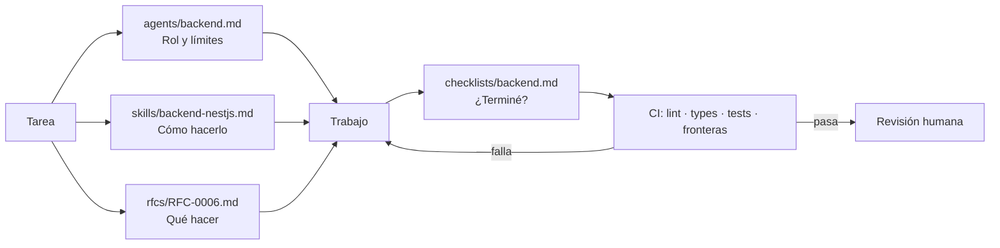
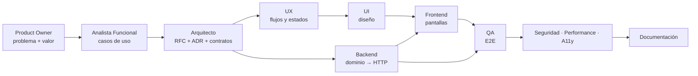

# 10 — Estrategia para IA

**Dueño:** Arquitecto · **Última revisión:** 2026-08-06 · **Estado:** Vigente

Este repositorio está diseñado para que **agentes de IA implementen con el mínimo contexto
posible y sin generar deuda técnica**. Este documento explica el mecanismo.

---

## 1. El problema que resuelve

Un agente de IA falla por tres motivos, siempre los mismos:

1. **Contexto insuficiente** → inventa convenciones que no existen.
2. **Contexto excesivo** → se pierde, contradice decisiones ya tomadas, alucina.
3. **Criterio de terminación ambiguo** → entrega algo que compila pero no sirve.

La respuesta de este repositorio: **contexto acotado, prescriptivo y verificable por
máquina**.

---

## 2. El contrato de contexto mínimo

Un agente **no lee el repositorio entero**. Lee exactamente cinco cosas:

```
1. agents/<su-agente>.md          ← quién es, qué puede y qué no
2. skills/<su-dominio>.md         ← cómo se hace bien aquí
3. rfcs/RFC-XXXX-<feature>.md     ← qué construye ahora
4. docs/03-conventions.md         ← reglas mecánicas
5. checklists/<dominio>.md        ← cuándo ha terminado
```

Total: unas 1 500 líneas. Suficiente para implementar. Insuficiente para divagar.

Todo lo demás se consulta **bajo demanda y con enlace explícito**: si el RFC dice
"ver ADR-0009", el agente abre ese ADR y sólo ese.



---

## 3. Los tres artefactos y sus roles

| Artefacto | Responde | Analogía |
| --------- | -------- | -------- |
| **Agente** | *Quién soy, qué puedo tocar, qué entrego* | Contrato laboral |
| **Skill** | *Cómo se hace bien esto en este repo* | Manual del oficio |
| **RFC** | *Qué hay que construir ahora y por qué* | Orden de trabajo |

Separarlos evita el error habitual de meter todo en un prompt gigante: el agente es
estable, la skill cambia poco, el RFC cambia en cada feature.

---

## 4. Reglas de operación de los agentes

### 4.1 Prohibiciones absolutas

Un agente **nunca**:

1. Escribe código de producto sin RFC aprobado que lo cubra.
2. Toca archivos fuera del ámbito declarado en su agente.
3. Toma una decisión de arquitectura. Si hace falta decidir, **para y escribe un ADR**.
4. Inventa una convención. Si falta, **para y pregunta**.
5. Añade una dependencia sin ADR.
6. Modifica un contrato de `@eusse/contracts` sin actualizar consumidores y tests.
7. Desactiva un test, un lint o una puerta de CI para pasar.
8. Deja `any`, `@ts-ignore`, `TODO` sin issue, o código comentado.
9. Mergea sin revisión humana (regla vigente durante toda la Fase 1).

### 4.2 Protocolo de bloqueo

Ante ambigüedad, el agente **no adivina**. Emite:

```markdown
## BLOQUEO

**Agente:** Backend
**Tarea:** RFC-0006 · Resolución de precio por cuenta
**Ambigüedad:** El RFC no define qué ocurre si una cuenta tiene dos listas de
precios vigentes que cubren el mismo SKU.
**Opciones:**
  A) Gana la lista con prioridad más alta (requiere campo `priority`).
  B) Gana el precio más bajo.
  C) Es un error de configuración → `PRICING_AMBIGUOUS_PRICE_LIST`.
**Recomendación:** C — un precio ambiguo en B2B es un fallo de datos, no algo
que el sistema deba resolver en silencio.
**Impacto:** bloquea E2, E5. No bloquea E1.
```

Escalado: Agente → Arquitecto → Product Owner. Un bloqueo se resuelve **por escrito** y su
resolución **modifica el RFC**. Así la ambigüedad no vuelve.

### 4.3 Protocolo de entrega

Cada entrega incluye:

```markdown
## ENTREGA

**Tarea:** RFC-0006 · E3 Dominio Cart
**Archivos:** (lista completa, con creado/modificado)
**Decisiones tomadas dentro del margen del RFC:** (o "ninguna")
**Checklist:** checklists/backend.md — todos los ítems marcados
**Tests:** 24 unitarios, 6 de integración. Cobertura de dominio: 94%
**Puertas de CI:** lint ✅ · types ✅ · tests ✅ · fronteras ✅ · build ✅
**Deuda introducida:** ninguna / (descrita y registrada en docs/tech-debt.md)
**Qué NO hice y por qué:** revalidación de precio → depende de E5, fuera de alcance
**Siguiente paso sugerido:** E4 (persistencia)
```

---

## 5. Por qué esto no genera deuda técnica

La deuda técnica de la IA nace de generar código plausible pero incoherente con el
sistema. Cinco barreras lo impiden:

| Barrera | Qué bloquea | Verificado por |
| ------- | ----------- | -------------- |
| **RFC previo** | Código que resuelve el problema equivocado | Revisión humana |
| **Contratos Zod primero** | Interfaces inventadas o divergentes | Contract tests |
| **Fronteras de arquitectura** | Código en la capa equivocada | ESLint boundaries (CI) |
| **Cobertura de dominio ≥ 90%** | Reglas de negocio sin probar | Vitest coverage (CI) |
| **Definition of Done** | "Terminado" ambiguo | Checklist + CI |

**La clave:** cuatro de las cinco barreras las verifica una máquina. Un agente no puede
convencer a `tsc` de que su código está bien.

---

## 6. Qué hace bien y qué hace mal un agente de IA

Asignar tareas contra esta tabla es la mitad del resultado.

| Alta fiabilidad — delegar | Baja fiabilidad — supervisar de cerca |
| ------------------------- | ------------------------------------- |
| Implementar un contrato Zod ya especificado | Diseñar el modelo de dominio |
| Escribir tests desde criterios de aceptación | Decidir fronteras entre contextos |
| Traducir un diseño a componentes | Juzgar si una UX es buena |
| CRUD, adaptadores, mapeadores | Elegir entre trade-offs de arquitectura |
| Refactorizar con tests verdes de red | Optimizar rendimiento sin medir antes |
| Documentar código existente | Escribir el "por qué" de un ADR |
| Migrar patrones repetitivos | Modelar reglas de negocio no escritas |
| Detectar inconsistencias entre archivos | Priorizar producto |

**Corolario:** los agentes de diseño (Arquitecto, UX, Product Owner, Analista Funcional)
producen **documentos para revisión humana**, nunca código directo.

---

## 7. Composición de agentes

Un feature completo pasa por varios agentes en cadena. Cada uno recibe la salida del
anterior como entrada, no el repositorio entero.



Regla: **cada traspaso es un artefacto escrito**, no una conversación. Así cualquier
agente puede reanudar el trabajo de otro sin haber estado presente.

---

## 8. Configuración de Claude Code en este repositorio

```
.claude/
├── settings.json         Permisos, hooks, modelo
├── agents/               Generado desde /agents (ver scripts/README.md)
└── skills/               Generado desde /skills
```

Las carpetas raíz `agents/` y `skills/` son la **fuente de verdad** (versionadas,
revisables, legibles por cualquier herramienta). `.claude/` se sincroniza desde ellas con
`pnpm sync:claude`. Nunca se edita `.claude/agents` a mano.

**Skills externas instaladas**

| Skill | Origen | Para qué |
| ----- | ------ | -------- |
| `ui-ux-pro-max` | [nextlevelbuilder/ui-ux-pro-max-skill](https://github.com/nextlevelbuilder/ui-ux-pro-max-skill) | Sistemas de color, tipografía, estilos visuales, guías de UX y auditoría de diseño. La usan los agentes UI, UX y Design System. |

Uso previsto: `ui-ux-pro-max` aporta **inspiración y criterio visual**; `@eusse/tokens`
y [`skills/design-system.md`](../skills/design-system.md) aportan **la verdad de este
proyecto**. Ante conflicto, gana el design system del repositorio.

---

## 9. Prompt de arranque estándar

Todo agente empieza igual:

```
Eres el agente <NOMBRE> del proyecto Eusse World.

Lee, en este orden:
  1. agents/<nombre>.md
  2. skills/<dominio>.md
  3. rfcs/RFC-XXXX-<feature>.md
  4. docs/03-conventions.md
  5. checklists/<dominio>.md

Tarea: <descripción concreta y acotada>

Reglas:
- No escribas código fuera del alcance del RFC.
- No tomes decisiones de arquitectura: si hace falta una, emite un BLOQUEO.
- No modifiques archivos fuera de tu ámbito declarado.
- Termina con el formato ENTREGA de docs/10-ai-strategy.md §4.3.
- Si algo es ambiguo, PARA y pregunta. No adivines.
```

---

## 10. Métricas de la colaboración con IA

| Métrica | Objetivo | Qué indica si falla |
| ------- | -------- | ------------------- |
| PRs de agente aprobados sin cambios mayores | > 70% | Contexto o RFC insuficientes |
| Bloqueos emitidos por feature | 1–3 | 0 = está adivinando. >5 = el RFC está incompleto |
| Fallos de CI por violación de fronteras | < 5% de PRs | Las reglas no están claras en la skill |
| Deuda técnica introducida por PR de agente | 0 | Definition of Done demasiado laxa |
| Tiempo de revisión humana por PR | < 20 min | PRs demasiado grandes |

Estas métricas se revisan al cerrar cada bloque. Si un número se sale, **se corrige el
documento, no el agente**.
