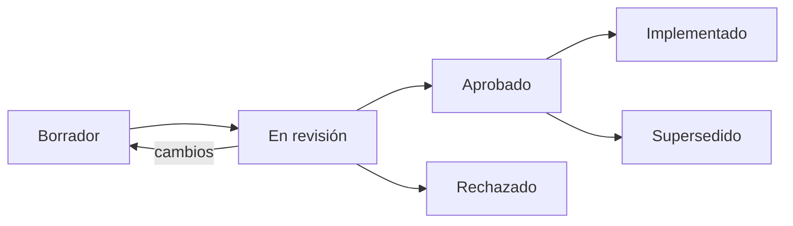

# RFCs — Request for Comments

Una propuesta de diseño escrita **antes** de implementar. Es el artefacto número uno de la
regla de los nueve ([`docs/04-standards.md`](../docs/04-standards.md) §1).

## Proceso

1. **Borrador** — el autor lo escribe usando [`templates/rfc.md`](../templates/rfc.md).
2. **En revisión** — PR abierto; revisan el Arquitecto, el Product Owner y los agentes
   implementadores afectados.
3. **Aprobado** — sin preguntas abiertas bloqueantes. Se puede implementar.
4. **Implementado** — el código existe y cumple lo que dice el RFC.

## Reglas

- **Un PR de tipo `feat` sin RFC referenciado se cierra sin revisar.**
- `fix`, `chore`, `docs`, `test` y `refactor` no necesitan RFC.
- **Un RFC no se aprueba con preguntas abiertas que bloqueen.**
- Los RFC evolucionan hasta aprobarse; después, un cambio significativo es un RFC nuevo.
- Un RFC breve es un RFC válido. La regla exige que la decisión esté **escrita antes**, no
  que sea larga.
- Los RFC se aprueban **con un sprint de antelación** respecto a su implementación.
- Cuando la implementación descubre una ambigüedad, se emite un BLOQUEO y **se actualiza el
  RFC**. Así la ambigüedad no vuelve.

## Índice

| RFC | Título | Estado | Bloque |
| --- | ------ | ------ | ------ |
| [0001](RFC-0001-platform-architecture.md) | Arquitectura general de la plataforma | Aprobado | A |
| [0002](RFC-0002-b2b-domain-model.md) | Modelo de dominio B2B | Aprobado | A |
| [0003](RFC-0003-identity-and-access.md) | Identidad, autenticación y autorización | Aprobado | B |
| [0004](RFC-0004-guest-intent-auth-return.md) | **Intención de compra del visitante y retorno post-login** | Aprobado | E |
| [0005](RFC-0005-catalog-and-search.md) | Catálogo, búsqueda y filtrado | Borrador | D |
| [0006](RFC-0006-cart-and-b2b-pricing.md) | Carrito y precios B2B | Borrador | E |
| [0007](RFC-0007-checkout-and-orders.md) | Checkout y órdenes | Borrador | F |
| [0008](RFC-0008-design-system.md) | Design System y tokens | Aprobado | A |
| [0009](RFC-0009-landing-and-brand.md) | Landing page e identidad visual | Borrador | C |
| [0010](RFC-0010-client-portal.md) | Portal de cliente | Borrador | G |
| [0011](RFC-0011-admin-backoffice.md) | Back-office administrativo | Borrador | H |
| [0012](RFC-0012-api-contracts.md) | Contratos de API y versionado | Aprobado | A |
| [0013](RFC-0013-domain-and-integration-events.md) | Eventos de dominio e integración | Aprobado | A |
| [0014](RFC-0014-i18n-and-multicurrency.md) | Internacionalización y multi-moneda | Borrador | A/C |
| [0015](RFC-0015-observability-and-quality.md) | Observabilidad, testing y calidad | Aprobado | A |

## Numeración

Correlativa, nunca reutilizada. Un RFC rechazado conserva su número: forma parte de la
historia del proyecto.
