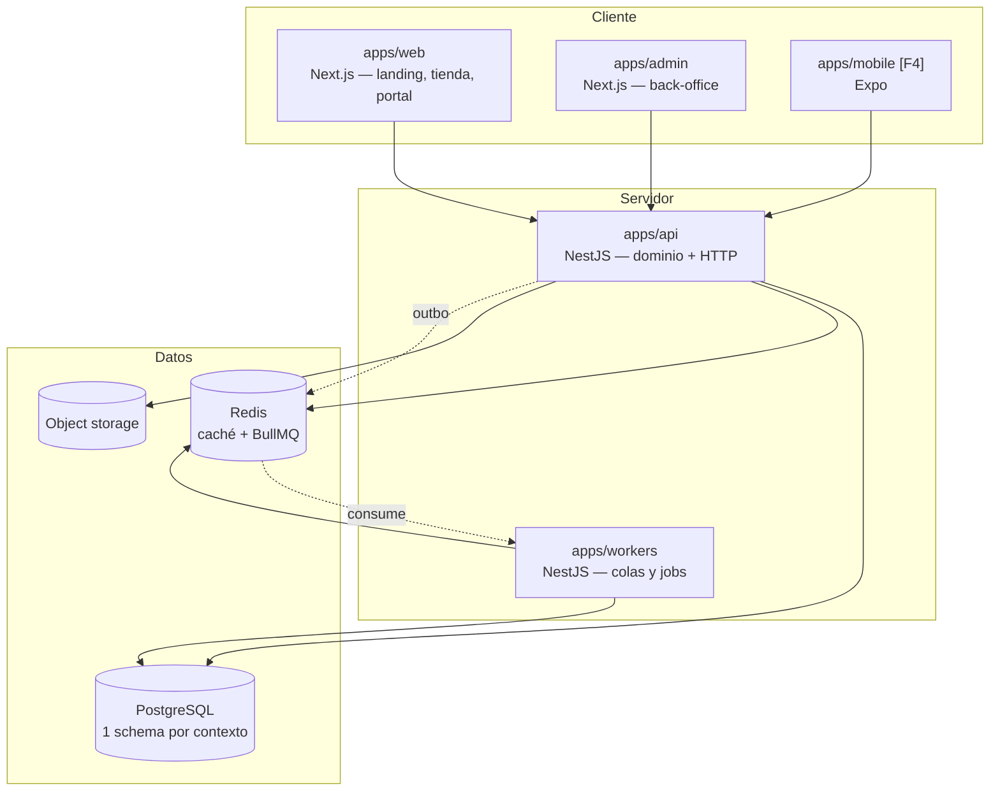

# RFC-0001 — Arquitectura general de la plataforma

| Campo | Valor |
| ----- | ----- |
| **Estado** | Aprobado |
| **Autor** | Arquitecto |
| **Revisores** | Backend · Frontend · DevOps · Base de Datos · Product Owner |
| **Creado** | 2026-08-06 |
| **ADR generados** | ADR-0001 … ADR-0007, ADR-0012, ADR-0014, ADR-0020 |
| **Bloque** | A |

---

## 1. Problema

Hay que construir una plataforma B2B con cinco superficies (landing, ecommerce, login,
portal de cliente, back-office) que además debe admitir CRM, Inventario, Cursos y una app
móvil **sin reescritura**, con un equipo pequeño y sin generar deuda estructural.

Las dos formas típicas de fallar:
- **Sobre-ingeniería**: microservicios y abstracciones para una escala que no existe. Se
  gasta el presupuesto en infraestructura en vez de en producto.
- **Sub-ingeniería**: un Next.js con toda la lógica en Route Handlers y Prisma. Rápido los
  tres primeros meses, imposible de mantener a partir del sexto.

## 2. Objetivos y no-objetivos

**Objetivos**
- Fronteras de dominio claras y **verificadas por CI**, no por buena voluntad.
- Un despliegue simple hoy, con capacidad de extraer servicios mañana sin rediseñar.
- Lógica de negocio testeable sin base de datos ni red.
- Contratos compartidos que permitan trabajo paralelo de backend y frontend.
- Preparación real (no especulativa) para CRM, Inventario, Cursos y móvil.

**No-objetivos**
- Microservicios en Fase 1.
- Kubernetes en Fase 1.
- Event sourcing.
- CQRS con base de lectura separada.
- Multi-región.

## 3. Alternativas consideradas

| Alternativa | Ventajas | Inconvenientes | Descarte |
| ----------- | -------- | -------------- | -------- |
| **A. Next.js full-stack** (todo en Route Handlers) | Máxima velocidad inicial; un solo despliegue | La lógica de negocio queda atada al framework de UI; imposible reutilizar en móvil; el testing de dominio requiere levantar Next | Descartada: la app móvil de Fase 4 obligaría a reescribir el backend |
| **B. Microservicios desde el día 1** | Fronteras físicas; escalado independiente | Coste operativo x5 sin equipo que lo opere; las fronteras aún se están descubriendo y quedarían congeladas mal | Descartada |
| **C. Monolito modular con hexagonal + EDA** | Fronteras verificables; dominio puro y reutilizable; un solo despliegue; extracción posterior barata | Más ceremonia que A en los CRUD simples | **Elegida**, con la mitigación de §4.6 |
| **D. Backend separado sin modularizar** | Simple | Reproduce el problema de A un nivel más abajo | Descartada |

## 4. Diseño

### 4.1 Componentes



**Regla de frontera:** ninguna app cliente habla con PostgreSQL, Redis ni terceros.
Todo pasa por `apps/api`.

### 4.2 Capas dentro de cada módulo

```
modules/<module>/
├── public/           ← ÚNICO punto de entrada desde otros módulos
├── domain/           sin framework, sin ORM, sin red
├── application/      casos de uso; orquestan dominio y puertos
├── infrastructure/   adaptadores: Prisma, Redis, HTTP saliente
└── interface/        controllers HTTP, consumidores de cola
```

Dependencias permitidas: `interface → application → domain` · `infrastructure → domain`.
**Verificado en CI** con `eslint-plugin-boundaries` y `dependency-cruiser`.

### 4.3 Comunicación entre módulos

**Por defecto: eventos.** Excepcionalmente: llamada síncrona al `public/` del otro módulo,
sólo si está declarada en la matriz de [`docs/07-module-dependencies.md`](../docs/07-module-dependencies.md) §2.

**Cero dependencias circulares.** Si A necesita B y B necesita A, uno de los dos publica un
evento.

### 4.4 Eventos con outbox

El evento se escribe en la misma transacción que el cambio de estado; un relay lo publica
a BullMQ. Entrega *at-least-once*; todo consumidor deduplica por `eventId`.
Detalle: [RFC-0013](RFC-0013-domain-and-integration-events.md).

### 4.5 Contratos compartidos

Zod como fuente de verdad en `@eusse/contracts`: genera tipos, validación, OpenAPI y el
SDK tipado. Es lo que permite que backend y frontend avancen en paralelo tras aprobar el
contrato. Detalle: [RFC-0012](RFC-0012-api-contracts.md).

### 4.6 Mitigación del coste de ceremonia

La objeción legítima a la alternativa C es que cuatro capas para un CRUD desmotiva y acaba
en gente saltándose el proceso. Mitigaciones explícitas:

1. **El CRUD sin invariantes no necesita dominio rico.** Un caso de uso que sólo lee y
   mapea puede ir de `application` a Prisma directamente. La ceremonia es para donde hay
   reglas de negocio.
2. **Generadores**: `pnpm gen:module`, `pnpm gen:use-case`, `pnpm gen:component`.
3. **Documentado explícitamente** en [`skills/backend-nestjs.md`](../skills/backend-nestjs.md).

### 4.7 Frontend

Dos aplicaciones (`web` y `admin`) por diferencias de riesgo, bundle y cadencia
([ADR-0004](../adrs/ADR-0004-web-admin-split.md)). Server Components por defecto.
Estrategia de renderizado por ruta declarada en
[`docs/01-architecture.md`](../docs/01-architecture.md) §4.5.

**Consecuencia crítica:** la ficha de producto se cachea **sin precio**; el precio se pide
autenticado desde el cliente. Es lo que hace compatible el SEO con los precios por cuenta.

### 4.8 Datos

Un esquema de PostgreSQL por contexto acotado, sin claves foráneas entre contextos. Permite
separar bases de datos después sin refactorizar código.
Detalle: [ADR-0006](../adrs/ADR-0006-postgres-prisma.md).

## 5. Impacto

| Área | Impacto |
| ---- | ------- |
| Contextos | Define todos |
| Paquetes | Define la estructura completa del monorepo |
| Rompedores | N/A (proyecto nuevo) |
| Rendimiento | Presupuestos en [`docs/04-standards.md`](../docs/04-standards.md) §6 |
| Seguridad | Frontera única en `apps/api`; sin acceso directo a datos desde el cliente |
| Observabilidad | `correlationId` de punta a punta desde el Bloque A |

## 6. Riesgos

| Riesgo | Prob. | Impacto | Mitigación verificable |
| ------ | ----- | ------- | ---------------------- |
| El monolito modular degenera en monolito | Alta | Alto | Fronteras en CI + revisión de arquitectura por bloque comparando el grafo real con el documentado |
| La ceremonia frena al equipo | Alta | Medio | §4.6: excepción explícita para CRUD + generadores |
| Caché de Turborepo que miente | Media | Medio | `inputs`/`outputs` explícitos; verificación periódica build limpio vs. cacheado |
| Sobre-preparación para fases futuras | Alta | Medio | Regla: se paga el hueco (puerto, evento, columna), nunca la habitación |

## 7. Criterios de aceptación

```gherkin
Escenario: Las fronteras se verifican automáticamente
  Dado un import de modules/pricing/domain desde modules/cart
  Cuando se ejecuta pnpm lint
  Entonces el build falla con un error de frontera

Escenario: El dominio es puro
  Dado cualquier archivo bajo apps/api/src/modules/*/domain/
  Cuando se analizan sus imports
  Entonces ninguno proviene de @nestjs/*, @prisma/client ni de otro módulo

Escenario: Un evento fluye de punta a punta
  Dado un caso de uso que emite un evento por outbox
  Cuando la transacción hace commit
  Entonces el relay lo publica y el worker lo consume una sola vez
  Y reprocesar el mismo eventId no produce efectos adicionales
```

## 8. Plan de implementación

Bloque A completo de [`docs/06-implementation-order.md`](../docs/06-implementation-order.md),
pasos A1–A15. Puerta A: las cuatro apps arrancan, CI verde y un evento fluye de API a worker.

## 9. Preparación para fases futuras

| Necesidad | Hueco que se deja | Lo que NO se construye |
| --------- | ----------------- | ---------------------- |
| CRM | Eventos de orden y cuenta ya publicados; contexto reservado | Pipeline, actividades, UI |
| Inventario | `InventoryPort` con adaptador trivial | Bodegas, reservas, conteos |
| Cursos | Contexto reservado; Identity admite usuarios sin cuenta B2B | Modelo LMS |
| App móvil | API versionada + `@eusse/contracts` y `@eusse/sdk` agnósticos | Cliente Expo |
| Multi-marca | `tenantId` en el modelo desde el día 1 | Resolución por dominio |

## 10. Preguntas abiertas

Ninguna abierta. Las resueltas están registradas en los ADR correspondientes.

## 11. Enlaces

[`docs/01-architecture.md`](../docs/01-architecture.md) ·
[`docs/07-module-dependencies.md`](../docs/07-module-dependencies.md) ·
ADR-0001 a ADR-0007 · [RFC-0012](RFC-0012-api-contracts.md) ·
[RFC-0013](RFC-0013-domain-and-integration-events.md)
