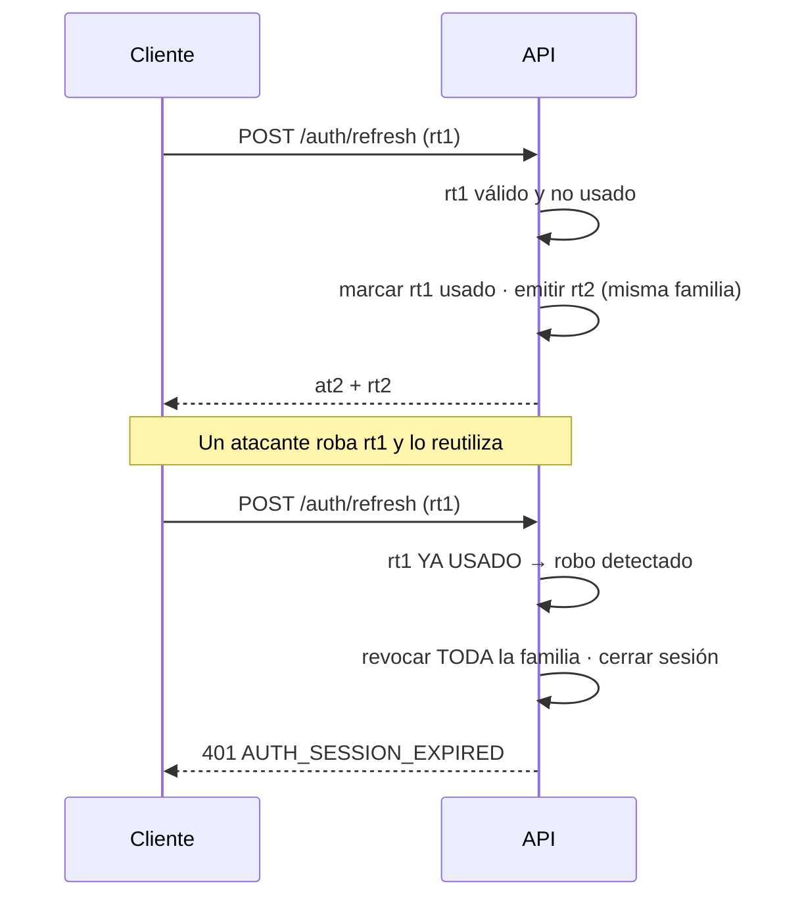
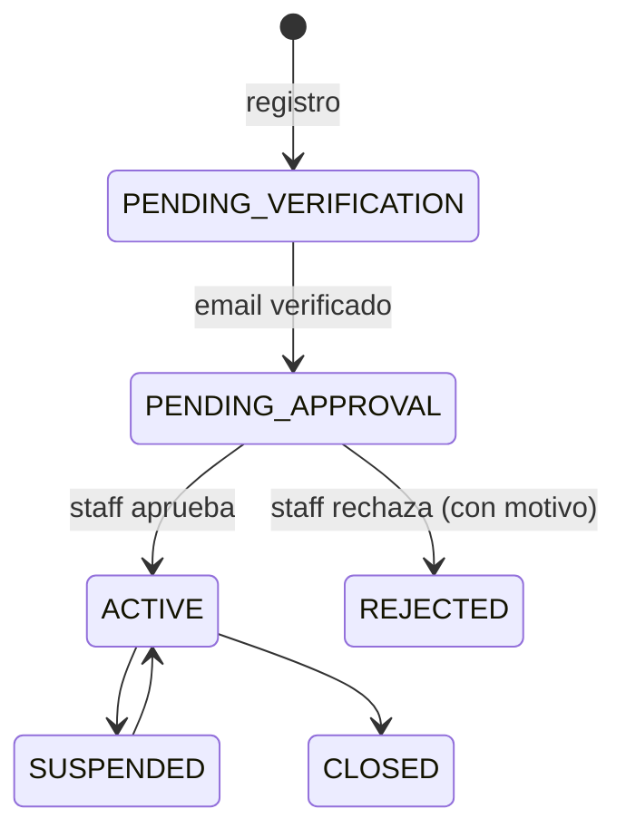

# RFC-0003 — Identidad, autenticación y autorización

| Campo             | Valor                                                          |
| ----------------- | -------------------------------------------------------------- |
| **Estado**        | Aprobado · **Autor** Arquitecto + Auth · **Creado** 2026-08-06 |
| **Revisores**     | Seguridad · Backend · Frontend · UX · Product Owner            |
| **ADR generados** | ADR-0008                                                       |
| **Bloque**        | B · Sprints 1–2                                                |

---

## 1. Problema

Todo el sistema depende de saber quién es el usuario y en nombre de qué cuenta opera. Es
el módulo del que cuelga todo lo demás y donde un error tiene consecuencias directas:
fuga de datos entre empresas competidoras.

Complicación específica de B2B: un usuario puede pertenecer a **varias cuentas** y opera
siempre en **una activa**. Cambiar de cuenta cambia precios, carrito y permisos.

## 2. Objetivos y no-objetivos

**Objetivos:** registro con aprobación · login, refresh, logout y recuperación seguros ·
multi-cuenta con cuenta activa · RBAC evaluado en servidor · sesión sin tokens accesibles
por JavaScript · auditoría de operaciones sensibles.

**No-objetivos:** SSO/SAML · MFA (preparado, no implementado en Fase 1) · registro
self-service sin aprobación · federación con redes sociales.

## 3. Alternativas consideradas

| Alternativa                                                                       | Ventajas                                                                                                           | Inconvenientes                                                                                                              | Descarte    |
| --------------------------------------------------------------------------------- | ------------------------------------------------------------------------------------------------------------------ | --------------------------------------------------------------------------------------------------------------------------- | ----------- |
| **A. Proveedor externo** (Auth0, Clerk)                                           | Rápido, MFA incluido                                                                                               | Coste por usuario; el modelo multi-cuenta con roles por cuenta no encaja en su modelo; dependencia crítica externa          | Descartada  |
| **B. NextAuth/Auth.js**                                                           | Integración natural con Next                                                                                       | La sesión vive en el frontend; la app móvil de F4 no la puede usar; el backend seguiría necesitando su propia autenticación | Descartada  |
| **C. Auth propia en `apps/api`, cookies httpOnly gestionadas por el BFF de Next** | Una sola fuente de identidad para web, admin y móvil; control total del modelo multi-cuenta; sin coste por usuario | Hay que implementarla y auditarla bien                                                                                      | **Elegida** |

## 4. Diseño

### 4.1 Modelo

```
User { id, email (único), passwordHash, status, emailVerifiedAt, lastLoginAt }
Membership { userId, accountId, role, approvalThreshold, status }
Session { id, userId, activeAccountId, createdAt, lastSeenAt, ip, userAgent }
RefreshToken { id, sessionId, familyId, hash, expiresAt, usedAt, revokedAt }
```

`Session.activeAccountId` es la clave del modelo multi-cuenta: define el contexto de toda
operación.

### 4.2 Tokens y cookies

| Token           | Vida               | Transporte                                                           |
| --------------- | ------------------ | -------------------------------------------------------------------- |
| Access (JWT)    | 15 min             | `__Host-eusse_at`, httpOnly, Secure, SameSite=Lax                    |
| Refresh (opaco) | 30 días, rotatorio | `__Host-eusse_rt`, httpOnly, Secure, SameSite=Lax, Path=/api/v1/auth |

Claims del access token: `sub` (userId), `sid` (sessionId), `acc` (activeAccountId),
`ten` (tenantId), `exp`, `iat`. **Los permisos no van en el token**: se evalúan en servidor
para que revocar un permiso tenga efecto inmediato.

### 4.3 Rotación de refresh con detección de reutilización



### 4.4 Registro y aprobación



El registro captura los datos de la empresa (razón social, `taxId`, contacto). **Sólo una
cuenta `ACTIVE` puede comprar**; antes, el usuario navega el catálogo sin precios.

### 4.5 Autorización

Tres niveles, todos en el servidor:

1. **Autenticado** — hay sesión válida.
2. **Permiso** — `@RequirePermission('order:create')` resuelto contra la membresía de la
   cuenta activa.
3. **Recurso** — el repositorio exige `accountId`; no existe `findById(id)` sin él.

```
findById(accountId: AccountId, orderId: OrderId): Promise<Order | null>
```

Si el recurso pertenece a otra cuenta → **404**, no 403 (403 confirma su existencia).

### 4.6 Cambio de cuenta activa

`POST /auth/switch-account { accountId }` → verifica membresía → reemite la sesión con la
nueva `activeAccountId` → el frontend invalida **todas** las claves de TanStack Query.
Carrito, precios y permisos se recargan. Es un cambio de contexto completo.

### 4.7 Endpoints

```
POST /api/v1/auth/register          → 201, cuenta PENDING_VERIFICATION
POST /api/v1/auth/verify-email      → 200
POST /api/v1/auth/login             → 200 + cookies
POST /api/v1/auth/refresh           → 200 + cookies rotadas
POST /api/v1/auth/logout            → 204, sesión invalidada en servidor
POST /api/v1/auth/forgot-password   → 202 (respuesta uniforme siempre)
POST /api/v1/auth/reset-password    → 200
POST /api/v1/auth/switch-account    → 200 + cookies reemitidas
GET  /api/v1/me                     → perfil, cuentas, cuenta activa, permisos
```

### 4.8 Errores

| Código                     | HTTP | Nota                                                             |
| -------------------------- | ---- | ---------------------------------------------------------------- |
| `AUTH_INVALID_CREDENTIALS` | 401  | **Idéntico** para email inexistente y contraseña incorrecta      |
| `AUTH_SESSION_EXPIRED`     | 401  | El cliente intenta refresh una vez y, si falla, redirige a login |
| `AUTH_FORBIDDEN`           | 403  | Sin permiso para la operación                                    |
| `AUTH_EMAIL_NOT_VERIFIED`  | 403  |                                                                  |
| `ACCOUNT_NOT_ACTIVE`       | 403  | Pendiente, suspendida o cerrada                                  |
| `AUTH_RATE_LIMITED`        | 429  |                                                                  |

### 4.9 Controles de seguridad

- Argon2id (`m=19456, t=2, p=1`), documentado en ADR-0008.
- Rate limiting: login 5/min por IP y 10/h por email; registro 3/h por IP; recuperación
  3/h por email.
- Respuesta insensible al tiempo en login y recuperación.
- Token de recuperación: aleatorio de 32 bytes, hash en base de datos, un solo uso,
  TTL 1 h.
- Logout invalida la sesión **en el servidor**.
- Auditoría: login, logout, cambio de contraseña, cambio de cuenta, cambio de rol,
  aprobación y rechazo de cuenta.

## 5. Impacto

Todos los módulos con datos privados dependen de este. Bloquea los bloques D, E, F, G, H.

## 6. Riesgos

| Riesgo                                  | Prob. | Impacto | Mitigación                                                           |
| --------------------------------------- | ----- | ------- | -------------------------------------------------------------------- |
| IDOR entre cuentas                      | Media | Crítico | Repositorio con `accountId` obligatorio por tipo + test por endpoint |
| Robo de token                           | Baja  | Crítico | httpOnly + rotación + detección de reutilización                     |
| Fuerza bruta                            | Alta  | Medio   | Rate limiting + Argon2id                                             |
| Enumeración de usuarios                 | Alta  | Medio   | Respuestas uniformes e insensibles al tiempo                         |
| Sesión obsoleta tras cambio de permisos | Media | Medio   | Permisos evaluados en servidor, no en el token                       |

## 7. Criterios de aceptación

```gherkin
Escenario: Aislamiento entre cuentas
  Dado un usuario autenticado en la cuenta A
  Cuando solicita una orden que pertenece a la cuenta B
  Entonces recibe 404

Escenario: Detección de reutilización de refresh
  Dado un refresh token ya utilizado
  Cuando se intenta usar de nuevo
  Entonces toda la familia de tokens se revoca
  Y el usuario debe autenticarse otra vez

Escenario: Cambio de cuenta activa
  Dado un usuario miembro de las cuentas A y B
  Cuando cambia de A a B
  Entonces ve el carrito de B, los precios de B y sus permisos en B

Escenario: Login no revela si el email existe
  Cuando se intenta iniciar sesión con un email inexistente
  Y cuando se intenta con un email existente y contraseña incorrecta
  Entonces ambas respuestas son AUTH_INVALID_CREDENTIALS
  Y sus tiempos de respuesta son indistinguibles
```

## 8. Plan de implementación

Pasos B1–B10 de [`docs/06-implementation-order.md`](../docs/06-implementation-order.md).

## 9. Preparación para fases futuras

**Hueco:** `User` admite usuarios sin membresía B2B (Cursos, F4) · `Session` tiene campo
para el método de autenticación (MFA, SSO) · el modelo de permisos admite permisos por
recurso además de por rol.
**No se construye:** MFA, SSO, federación.

## 10. Preguntas abiertas

Ninguna bloqueante.

## 11. Enlaces

[RFC-0002](RFC-0002-b2b-domain-model.md) · [RFC-0004](RFC-0004-guest-intent-auth-return.md) ·
[ADR-0008](../adrs/ADR-0008-auth-strategy.md) · [`skills/auth.md`](../skills/auth.md) ·
[`checklists/security.md`](../checklists/security.md)
