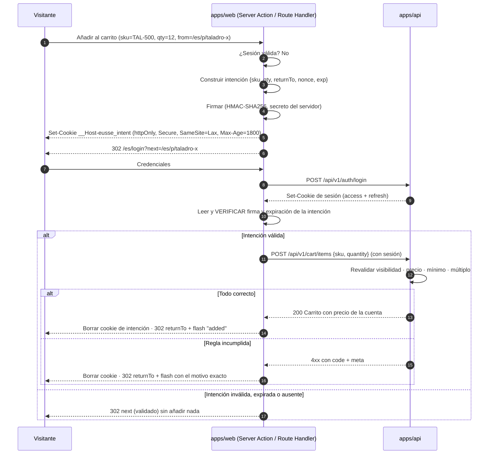
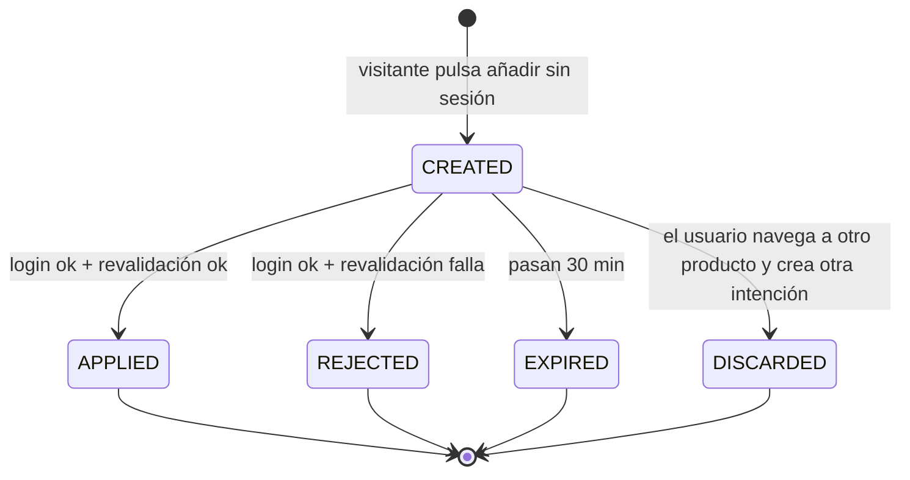

# RFC-0004 — Intención de compra del visitante y retorno post-login

| Campo | Valor |
| ----- | ----- |
| **Estado** | Aprobado |
| **Autor** | Arquitecto |
| **Revisores** | Auth (07) · Carrito (11) · UX (05) · Seguridad (23) · Product Owner (29) |
| **Creado** | 2026-08-06 |
| **ADR generados** | ADR-0008 |
| **Bloque / Sprint** | E7 · Sprint 7 |

---

## 1. Problema

El visitante puede explorar el catálogo libremente, pero **no puede ver su precio ni
comprar sin identificarse**: en B2B el precio depende del acuerdo comercial de su empresa.

Cuando un visitante pulsa "Añadir al carrito", hay que autenticarlo. La implementación
ingenua —redirigir a `/login` y dejarlo ahí— produce que:

1. Tras el login aterriza en el portal o en la home, no en el producto que quería.
2. Tiene que volver a buscar el producto, con la cantidad que ya había elegido.
3. La mayoría no lo hace. Es el punto de abandono más caro del embudo.

**Requisito de producto, no negociable:** tras el login, el visitante vuelve **al producto
que intentaba agregar**, con **la cantidad que había elegido**, y **el producto ya está en
su carrito con su precio real**.

## 2. Objetivos y no-objetivos

**Objetivos**
- Preservar la intención de compra (SKU + cantidad + origen) a través de la autenticación.
- Devolver al usuario exactamente al producto de origen.
- Aplicar la intención **con la cuenta real**, revalidando todo.
- Hacerlo sin abrir un vector de redirección abierta ni de manipulación.

**No-objetivos**
- Carrito de invitado persistente con varios productos. Se preserva **una** intención, la
  última.
- Precios visibles sin sesión.
- Compra sin cuenta.
- Preservar la intención más de 30 minutos.

## 3. Alternativas consideradas

| Alternativa | Ventajas | Inconvenientes | Descarte |
| ----------- | -------- | -------------- | -------- |
| **A. Carrito de invitado en `localStorage`, fusión al entrar** | Familiar en B2C; varios productos | El invitado no tiene precio: el carrito sería una lista sin importes. Manipulable. Fusión ambigua entre cuentas con acuerdos distintos | Descartada |
| **B. Intención en la query (`?sku=X&qty=10`)** | Trivial de implementar | Manipulable; vector de redirección abierta; se filtra en logs y `Referer` | Descartada |
| **C. Intención firmada en cookie httpOnly del servidor** | No manipulable, no visible al JS, TTL corto, un solo uso | Un solo producto por intención | **Elegida** |
| **D. Intención persistida en base de datos con ID en cookie** | Auditable, sin límite de tamaño | Escritura en base de datos por cada visitante que pulsa el botón; limpieza necesaria | Descartada por coste sin beneficio |

**Por qué C:** en B2B el visitante añade un producto puntual antes de identificarse, no
arma un carrito de 40 líneas de forma anónima. Una intención firmada, de un solo uso y de
vida corta cubre el caso real con la superficie de ataque mínima.

## 4. Diseño

### 4.1 Flujo completo



### 4.2 Estructura de la intención

```
PurchaseIntent {
  v: 1                      // versión del formato
  sku: string
  quantity: number          // entero positivo
  returnTo: string          // ruta interna, validada
  nonce: string             // UUID v7 — un solo uso
  exp: number               // epoch segundos, ahora + 1800
}
```

Serializada y firmada: `base64url(payload) + "." + base64url(HMAC-SHA256(payload, secret))`.

**Propiedades de seguridad**
- `httpOnly` → inaccesible desde JavaScript, inmune a XSS de lectura.
- Firmada → no manipulable sin el secreto del servidor.
- `exp` de 30 min → ventana de ataque mínima.
- `nonce` de un solo uso → registrado en Redis al consumir, con TTL igual al de la cookie.
- `SameSite=Lax` → no viaja en peticiones cross-site de terceros.
- Prefijo `__Host-` → sin `Domain`, ruta `/`, obligatoriamente `Secure`.

### 4.3 Validación de `returnTo` y de `next`

**Este es el control de seguridad crítico del RFC** (riesgo R-02).

```
function safeReturnTo(candidate: string | null): string {
  if (!candidate)                      return DEFAULT_RETURN
  if (!candidate.startsWith('/'))      return DEFAULT_RETURN   // sin esquema ni host
  if (candidate.startsWith('//'))      return DEFAULT_RETURN   // sin protocolo relativo
  if (candidate.includes('\\'))        return DEFAULT_RETURN   // sin escape por barra invertida
  if (candidate.includes('\n') ||
      candidate.includes('\r'))        return DEFAULT_RETURN   // sin inyección de cabecera
  const decoded = safeDecode(candidate)                        // decodificar una vez
  if (decoded !== candidate && !isSafeShape(decoded)) return DEFAULT_RETURN
  return ALLOWED_RETURN_PATTERNS.some((r) => r.test(candidate)) ? candidate : DEFAULT_RETURN
}

const ALLOWED_RETURN_PATTERNS = [
  /^\/(es|en)\/p\/[a-z0-9-]+$/,          // ficha de producto
  /^\/(es|en)\/c\/[a-z0-9-]+$/,          // categoría
  /^\/(es|en)\/catalog(\?.*)?$/,         // listado
  /^\/(es|en)\/search(\?.*)?$/,          // búsqueda
  /^\/(es|en)\/cart$/,                   // carrito
  /^\/(es|en)\/dashboard$/,              // portal
]
```

**Corpus de payloads obligatorio en CI** — todos deben resolver a `DEFAULT_RETURN`:

```
//evil.com                    https://evil.com              http:/evil.com
/\evil.com                    /\/evil.com                   \\evil.com
javascript:alert(1)           data:text/html,<script>       /%2f%2fevil.com
/es/p/x?next=//evil.com       /es/p/x%0d%0aSet-Cookie:x=y   ///evil.com
/es/../../admin               /es/p/<script>                /es/p/x#@evil.com
```

### 4.4 Revalidación tras el login

**La intención nunca se aplica a ciegas.** Se revalida con la cuenta real:

| Comprobación | Si falla |
| ------------ | -------- |
| La variante existe | `CATALOG_VARIANT_NOT_FOUND` → mensaje y no se agrega |
| Es visible para la cuenta | `CATALOG_VARIANT_NOT_VISIBLE` → "Este producto no está disponible para tu cuenta" |
| Hay precio para la cuenta | `PRICING_NO_PRICE_FOR_ACCOUNT` → "Consulta con tu asesor" |
| Cantidad ≥ `minOrderQty` | `CART_QTY_BELOW_MINIMUM` → se ofrece ajustar al mínimo |
| Cantidad múltiplo de `qtyIncrement` | `CART_QTY_NOT_MULTIPLE` → se ofrece el múltiplo más cercano |
| Cuenta `ACTIVE` | `ACCOUNT_NOT_ACTIVE` → "Tu cuenta está pendiente de aprobación" |
| Permiso `cart:write` | `AUTH_FORBIDDEN` → "No tienes permiso para agregar productos" |

En todos los casos **se vuelve a `returnTo`** y se muestra el motivo con precisión. Nunca
un fallo silencioso.

### 4.5 Contratos

```
// packages/contracts/src/auth/purchase-intent.contract.ts
export const purchaseIntentSchema = z.object({
  v: z.literal(1),
  sku: skuSchema,
  quantity: z.number().int().positive().max(MAX_CART_QTY),
  returnTo: z.string().startsWith('/'),
  nonce: z.string().uuid(),
  exp: z.number().int(),
})

export const intentOutcomeSchema = z.discriminatedUnion('status', [
  z.object({ status: z.literal('applied'), sku: skuSchema, quantity: z.number(), productName: z.string() }),
  z.object({ status: z.literal('rejected'), code: errorCodeSchema, meta: z.record(z.unknown()) }),
  z.object({ status: z.literal('expired') }),
  z.object({ status: z.literal('none') }),
])
```

### 4.6 Estados de la intención



Sólo existe **una** intención activa. Crear una nueva descarta la anterior.

### 4.7 Errores

| Código | HTTP | Cuándo | Qué ve el usuario |
| ------ | ---- | ------ | ----------------- |
| — | 302 | Intención ausente o expirada | Vuelve a `next`, sin mensaje de error |
| `AUTH_INTENT_INVALID_SIGNATURE` | 400 | Firma no válida (manipulación) | Vuelve a `/`, se registra como incidente de seguridad |
| `AUTH_INTENT_ALREADY_USED` | 409 | `nonce` ya consumido | Vuelve a `returnTo`, sin duplicar |
| `CATALOG_VARIANT_NOT_VISIBLE` | 403 | No visible para la cuenta | "Este producto no está disponible para tu cuenta" |
| `PRICING_NO_PRICE_FOR_ACCOUNT` | 422 | Sin lista aplicable | "Consulta con tu asesor comercial" |
| `CART_QTY_BELOW_MINIMUM` | 422 | Cantidad insuficiente | "La cantidad mínima es N" + acción de ajuste |
| `CART_QTY_NOT_MULTIPLE` | 422 | No múltiplo | "Se vende en cajas de N" + acción de ajuste |
| `ACCOUNT_NOT_ACTIVE` | 403 | Cuenta pendiente o suspendida | "Tu cuenta está pendiente de aprobación" |

### 4.8 Interfaz de usuario

**Al pulsar "Añadir al carrito" sin sesión** — sin diálogo intermedio, sin fricción: se
redirige directamente. Un modal de "inicia sesión primero" añade un clic sin aportar nada.

**Página de login con contexto**

> **Inicia sesión para continuar**
> Te devolveremos a **Taladro percutor industrial X** y añadiremos las 12 unidades a tu
> carrito.

Saber que no se va a perder el trabajo reduce el abandono.

**Al volver, éxito** — toast, contador del carrito animado y el botón del producto en
estado "En el carrito · 12".

**Al volver, rechazo** — el motivo en línea, junto al selector de cantidad, con la acción
correctiva:

> No pudimos añadirlo: TAL-500 se vende en cajas de 6 unidades.
> [Añadir 12 unidades]

## 5. Impacto

| Área | Impacto |
| ---- | ------- |
| Contextos | Identity (firma y verificación) · Cart (aplicación) · Catalog (revalidación) |
| Paquetes | `@eusse/auth`, `@eusse/contracts` |
| Rompedores | Ninguno (funcionalidad nueva) |
| Migración | Ninguna |
| Rendimiento | Una verificación HMAC y una escritura en Redis por login con intención. Despreciable |
| **Seguridad** | **Alto.** Redirección abierta e IDOR son los riesgos principales. Revisión obligatoria del agente 23 |
| Accesibilidad | El mensaje de resultado se anuncia con `aria-live` |
| i18n | Mensajes de resultado en `es` y `en` |
| SEO | Ninguno: la ficha de producto sigue siendo estática e indexable |
| Observabilidad | Evento `intent.created` / `intent.applied` / `intent.rejected` con motivo, para medir el embudo |

## 6. Riesgos

| Riesgo | Prob. | Impacto | Mitigación verificable |
| ------ | ----- | ------- | ---------------------- |
| Redirección abierta | Alta | Crítico | Allowlist + corpus de payloads en CI + revisión de Seguridad |
| Intención aplicada sin revalidar | Media | Alto | Test E2E por cada regla de rechazo |
| Reutilización de la intención | Media | Medio | `nonce` de un solo uso registrado en Redis |
| Cookie que sobrevive al cierre de sesión | Baja | Medio | Se borra en logout y al consumirse |
| Manipulación del `sku` o la cantidad | Media | Alto | Firma HMAC + revalidación en servidor |
| Confusión si el usuario cambia de cuenta activa antes de aplicar | Baja | Bajo | La intención se aplica a la cuenta activa tras el login; se indica en el mensaje |

## 7. Criterios de aceptación

```gherkin
Escenario: Retorno exitoso con el producto añadido
  Dado un visitante sin sesión en la ficha de "Taladro percutor industrial X"
  Y que la cantidad seleccionada es 12
  Cuando pulsa "Añadir al carrito"
  Entonces es redirigido a /es/login
  Y la página de login indica a qué producto volverá
  Cuando inicia sesión con credenciales válidas de una cuenta ACTIVE
  Entonces vuelve a /es/p/taladro-percutor-industrial-x
  Y ve el mensaje "Añadido: 12 × Taladro percutor industrial X"
  Y el contador del carrito muestra 12
  Y el carrito contiene la línea con el precio de su cuenta

Escenario: Producto no visible para la cuenta
  Dado un visitante que intenta añadir un SKU con visibilidad ACCOUNT_RESTRICTED
  Cuando inicia sesión con una cuenta no autorizada para ese SKU
  Entonces vuelve a la ficha del producto
  Y ve "Este producto no está disponible para tu cuenta"
  Y el carrito no se modifica

Escenario: Cantidad no múltiplo del incremento de venta
  Dado un visitante que intenta añadir 7 unidades de un SKU con qtyIncrement 6
  Cuando inicia sesión
  Entonces vuelve a la ficha del producto
  Y ve "Se vende en cajas de 6 unidades"
  Y se le ofrece la acción "Añadir 12 unidades"
  Y el carrito no se modifica

Escenario: Intención expirada
  Dado un visitante con una intención creada hace 31 minutos
  Cuando inicia sesión
  Entonces vuelve a la ficha del producto
  Y el carrito no se modifica
  Y no se muestra ningún mensaje de error

Escenario: Redirección abierta bloqueada
  Dado un enlace /es/login?next=https://sitio-malicioso.com
  Cuando el usuario inicia sesión
  Entonces es redirigido a / y nunca a un dominio externo

Escenario: Intención de un solo uso
  Dado un visitante cuya intención ya se aplicó
  Cuando repite la petición con la misma cookie
  Entonces el carrito no cambia
  Y no se crea una línea duplicada
```

## 8. Plan de implementación

| # | Paso | Agente | Depende de |
| - | ---- | ------ | ---------- |
| 1 | Contratos de intención y resultado | Auth + Frontend | RFC aprobado |
| 2 | Firma, verificación y `safeReturnTo` en `@eusse/auth` | Auth | 1 |
| 3 | Corpus de payloads maliciosos + tests | Seguridad | 2 |
| 4 | Route Handler de "añadir sin sesión" | Auth + Frontend | 2 |
| 5 | Registro de `nonce` consumido en Redis | Auth | 2 |
| 6 | Aplicación tras login con revalidación completa | Carrito | E5 (casos de uso del carrito) |
| 7 | UI: login con contexto, toast de resultado, estado del botón | UI + UX | 4 |
| 8 | Telemetría del embudo (`created`/`applied`/`rejected`) | Frontend | 4 |
| 9 | E2E de los seis escenarios de aceptación | Testing | 6, 7 |
| 10 | Revisión de seguridad | Seguridad | 9 |

## 9. Preparación para fases futuras

**Hueco dejado**
- El formato de la intención lleva `v: 1`: admite evolucionar a varias líneas sin romper.
- El mecanismo de firma y validación de retorno se reutilizará para otras acciones que
  requieran identificación (solicitar cotización, descargar ficha técnica).

**Explícitamente NO se construye ahora**
- Carrito de invitado con varios productos.
- Fusión de intenciones al cambiar de cuenta activa.
- Persistencia de la intención más allá de 30 minutos.

## 10. Preguntas abiertas

| # | Pregunta | Bloquea | Resuelta |
| - | -------- | ------- | -------- |
| 1 | ¿Un usuario con varias cuentas debe elegir cuenta antes de aplicar la intención? | No (E6) | **Sí** — se aplica a la última cuenta activa; si nunca eligió, a la primera por orden alfabético, y se indica en el mensaje |
| 2 | ¿Se conserva la intención si el usuario se registra en vez de iniciar sesión? | No | **Sí** — se conserva, pero la cuenta nace `PENDING_VERIFICATION`: se informa de que se aplicará al aprobarse, y la intención se descarta |

## 11. Enlaces

[RFC-0003](RFC-0003-identity-and-access.md) · [RFC-0006](RFC-0006-cart-and-b2b-pricing.md) ·
[ADR-0008](../adrs/ADR-0008-auth-strategy.md) ·
[`skills/auth.md`](../skills/auth.md) · [`skills/cart.md`](../skills/cart.md) ·
[`checklists/security.md`](../checklists/security.md) ·
[`docs/08-technical-risks.md`](../docs/08-technical-risks.md) R-02
