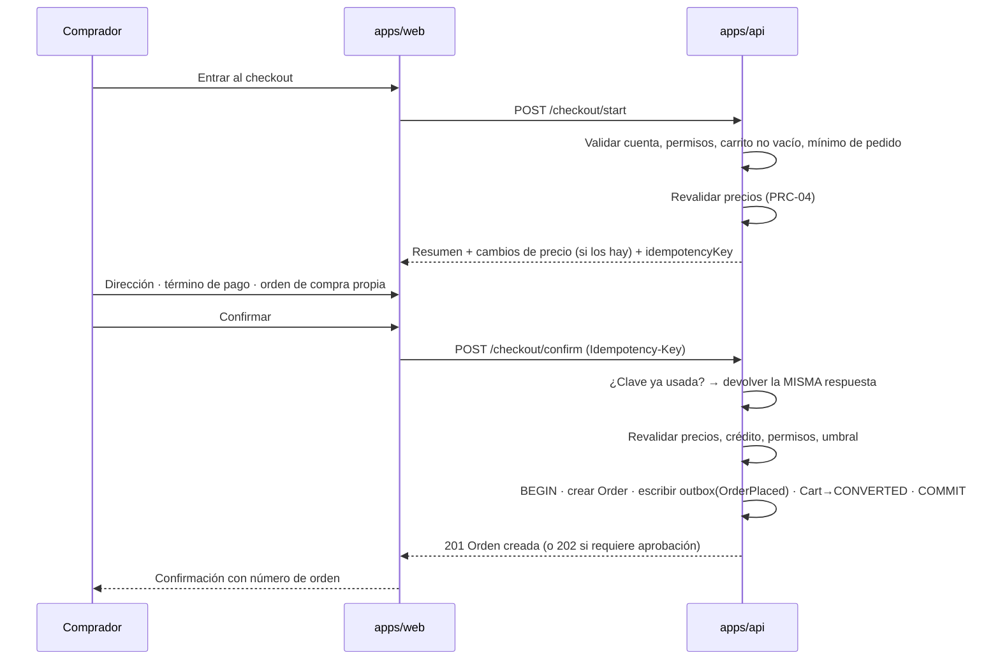

# RFC-0007 — Checkout y órdenes

| Campo             | Valor                                                              |
| ----------------- | ------------------------------------------------------------------ |
| **Estado**        | Borrador · **Autor** Arquitecto + Checkout · **Creado** 2026-08-06 |
| **Revisores**     | Backend · Pagos · Tracking · UX · Seguridad · QA · Product Owner   |
| **ADR generados** | ADR-0018                                                           |
| **Bloque**        | F · Sprints 8–9                                                    |

---

## 1. Problema

El checkout es donde el dinero cambia de manos y donde un bug se convierte en una llamada
del cliente. Tres exigencias simultáneas:

1. **Sin duplicados.** Un doble clic no puede generar dos pedidos (riesgo R-04).
2. **Sin sorpresas de precio.** Lo que se confirma es lo que se mostró, o se avisa.
3. **Sin estados inconsistentes** cuando un tercero falla.

Más las particularidades B2B: aprobación por umbral, orden de compra del cliente, pago a
crédito y mínimos de pedido.

## 2. Objetivos y no-objetivos

**Objetivos:** checkout multi-paso recuperable · confirmación idempotente · revalidación
de precio con confirmación explícita · aprobación por umbral · máquina de estados de la
orden · eventos por outbox · puertos de pago, inventario y envío.

**No-objetivos:** pasarela de pago real (F2) · inventario real (F2) · integración con
transportadora (F2) · facturación electrónica (F2) · devoluciones (F2).

## 3. Alternativas consideradas

**Cuándo se crea la orden**

| Alternativa                                                             | Descarte                                                                      |
| ----------------------------------------------------------------------- | ----------------------------------------------------------------------------- |
| A. Tras confirmar el pago                                               | Si la pasarela cobra y la creación falla, hay un cobro sin orden. Inaceptable |
| **B. Antes de llamar a cualquier tercero, en estado `PENDING_PAYMENT`** | **Elegida.** Un fallo deja una orden recuperable y auditable                  |

**Coordinación entre módulos**

| Alternativa                     | Descarte                                                           |
| ------------------------------- | ------------------------------------------------------------------ |
| A. Saga con orquestador central | Complejidad no justificada con cuatro módulos                      |
| **B. Coreografía por eventos**  | **Elegida.** Cada módulo reacciona a `OrderPlaced` y emite lo suyo |

## 4. Diseño

### 4.1 Flujo



### 4.2 Idempotencia

- La clave se genera **al montar el formulario**, no al pulsar. Si se generase al pulsar,
  cada clic produciría una clave distinta y la protección sería inútil.
- Restricción única en base de datos: `(account_id, idempotency_key)`.
- Misma clave + mismo payload → misma respuesta, sin efectos.
- Misma clave + payload distinto → `409 COMMON_IDEMPOTENCY_CONFLICT`.
- Verificado con un test de 10 peticiones concurrentes.

### 4.3 Validaciones al confirmar

En este orden, todas en el servidor:

| #   | Validación                                        | Error                         |
| --- | ------------------------------------------------- | ----------------------------- |
| 1   | Cuenta `ACTIVE`                                   | `ACCOUNT_NOT_ACTIVE`          |
| 2   | Permiso `order:create`                            | `AUTH_FORBIDDEN`              |
| 3   | Carrito no vacío                                  | `CART_EMPTY`                  |
| 4   | Todas las líneas disponibles y visibles           | `CATALOG_VARIANT_NOT_VISIBLE` |
| 5   | Cantidades válidas (mínimos y múltiplos actuales) | `CART_QTY_*`                  |
| 6   | Precios vigentes                                  | `PRICING_PRICE_CHANGED` (409) |
| 7   | Total ≥ `minOrderAmount` de la cuenta             | `CHECKOUT_BELOW_MIN_ORDER`    |
| 8   | Crédito suficiente si el pago es a crédito        | `ACCOUNT_CREDIT_EXCEEDED`     |
| 9   | Total vs. `approvalThreshold` del comprador       | → `PENDING_APPROVAL` (202)    |

### 4.4 Modelo

```
Order      { id, tenantId, accountId, orderNumber, status, placedByUserId,
             customerPoNumber, shippingAddress, billingAddress, paymentTerm,
             subtotal, taxTotal, shippingTotal, discountTotal, grandTotal: Money,
             idempotencyKey, version }
OrderLine  { id, orderId, sku, productName, quantity, unitPrice, lineTotal: Money }
```

**`OrderLine` copia el nombre del producto**: si el catálogo cambia, la orden histórica
sigue siendo fiel a lo que se compró.

### 4.5 Máquina de estados

Ver [`docs/02-domain-model.md`](../docs/02-domain-model.md) §4. Toda transición pasa por el
agregado; las inválidas lanzan `ORDER_INVALID_TRANSITION`.

Regla `CHK-02b`: **el aprobador debe ser distinto del creador.** Un aprobador que se
autoriza a sí mismo anula el control que motiva la funcionalidad.

### 4.6 Numeración

`EW-{año}-{secuencia:6}` con secuencia de PostgreSQL por año. Nunca `COUNT(*) + 1`.

### 4.7 Puertos con adaptador mínimo en Fase 1

| Puerto          | Adaptador F1                     | Adaptador F2      |
| --------------- | -------------------------------- | ----------------- |
| `PaymentPort`   | Offline: transferencia o crédito | Pasarela real     |
| `InventoryPort` | Siempre disponible               | Inventario propio |
| `ShippingPort`  | Tarifa plana por zona            | Transportadora    |

El checkout está **completo** desde la Fase 1: los adaptadores reales llegan sin tocar
dominio ni UI.

### 4.8 Eventos

`orders.OrderPlaced.v1` · `orders.OrderApproved.v1` · `orders.OrderRejected.v1` ·
`orders.OrderCancelled.v1` · `orders.OrderShipped.v1`.
Todos por outbox, dentro de la transacción. Consumidores: Notifications (F1),
Inventory/Payments (F2), CRM/Analytics (F3).

### 4.9 Interfaz de usuario

Tres pasos, con progreso visible y resumen del pedido siempre a la vista:

1. **Revisar** — líneas, cantidades, avisos de cambio de precio.
2. **Entrega** — dirección de despacho y de facturación, **orden de compra del cliente**
   (destacada: es lo que su contabilidad necesita).
3. **Pago y confirmación** — término de pago, totales desglosados, botón único.

Reglas de UX: cada paso es recuperable sin perder datos · el botón se deshabilita durante
el envío · ningún importe cambia entre el paso 1 y el 3 sin aviso explícito · el coste de
envío es visible desde el paso 1.

## 5. Impacto

| Área           | Impacto                                                                  |
| -------------- | ------------------------------------------------------------------------ |
| Contextos      | Checkout y Orders (nuevos) · Cart (conversión) · Notifications (consume) |
| Rendimiento    | Confirmar < 500 ms p95, excluyendo terceros                              |
| **Seguridad**  | Importes del servidor · idempotencia · autorización por operación        |
| Observabilidad | Evento por cada paso del embudo, para medir abandono                     |

## 6. Riesgos

| Riesgo                                    | Prob. | Impacto | Mitigación verificable                                           |
| ----------------------------------------- | ----- | ------- | ---------------------------------------------------------------- |
| Órdenes duplicadas                        | Alta  | Alto    | Idempotencia + restricción única + test de 10 concurrentes       |
| Cobro distinto al mostrado                | Media | Crítico | Revalidación en el paso final con confirmación explícita         |
| Estado inconsistente por fallo de tercero | Media | Alto    | Orden creada antes de llamar a terceros; test de fallo inyectado |
| Colisión de número de orden               | Baja  | Medio   | Secuencia de PostgreSQL; test de concurrencia                    |
| Crédito superado por pedidos simultáneos  | Media | Alto    | Reserva de crédito dentro de la transacción de confirmación      |

## 7. Criterios de aceptación

```gherkin
Escenario: Doble clic no duplica la orden
  Dado un carrito válido
  Cuando se envían 10 confirmaciones concurrentes con la misma Idempotency-Key
  Entonces se crea exactamente una orden
  Y las 10 respuestas contienen el mismo orderId

Escenario: Cambio de precio requiere confirmación explícita
  Dado un carrito con un precio congelado que ya cambió
  Cuando el comprador intenta confirmar
  Entonces recibe PRICING_PRICE_CHANGED con el detalle del cambio
  Y la orden no se crea hasta que confirme con acceptPriceChanges

Escenario: Aprobación por umbral
  Dado un comprador con approvalThreshold de 5.000.000 COP
  Cuando confirma un pedido de 7.500.000 COP
  Entonces la orden queda en PENDING_APPROVAL
  Y no se cursa
  Y el aprobador recibe una notificación

Escenario: El aprobador no puede aprobar su propio pedido
  Dado un usuario con rol APPROVER que creó un pedido pendiente
  Cuando intenta aprobarlo
  Entonces la operación se rechaza con AUTH_FORBIDDEN

Escenario: Crédito insuficiente
  Dada una cuenta con crédito disponible de 1.000.000 COP
  Cuando intenta confirmar un pedido a crédito de 2.000.000 COP
  Entonces recibe ACCOUNT_CREDIT_EXCEEDED
  Y la orden no se crea

Escenario: Fallo de tercero deja estado consistente
  Dado que el adaptador de envío falla al cotizar
  Cuando el comprador confirma
  Entonces la orden existe en estado recuperable
  Y no hay cobro asociado
  Y se registra el fallo con correlationId
```

## 8. Plan de implementación

Pasos F1–F15 de [`docs/06-implementation-order.md`](../docs/06-implementation-order.md).

## 9. Preparación para fases futuras

**Hueco:** `Fulfillment` como agregado propio desde el modelo (envíos parciales en F2) ·
`Payment` como agregado propio · `Order` admite referencia a `Quote` (F3) · eventos ya
publicados para CRM y Analytics.
**No se construye:** pasarela, inventario, transportadora, facturación, devoluciones.

## 10. Preguntas abiertas

| #   | Pregunta                                        | Bloquea | Resuelta                                                                                                                                         |
| --- | ----------------------------------------------- | ------- | ------------------------------------------------------------------------------------------------------------------------------------------------ |
| 1   | ¿Puede cancelarse una orden ya en `PROCESSING`? | F8      | **Sí**, sólo por staff con permiso `order:cancel` y motivo obligatorio. El cliente sólo puede cancelar en `PENDING_PAYMENT` y `PENDING_APPROVAL` |
| 2   | ¿Qué pasa si el aprobador no actúa?             | F8      | La orden expira a los 7 días → `CANCELLED` con motivo `APPROVAL_TIMEOUT`, con recordatorios a los días 3 y 6                                     |

## 11. Enlaces

[RFC-0006](RFC-0006-cart-and-b2b-pricing.md) · [RFC-0013](RFC-0013-domain-and-integration-events.md) ·
[`skills/checkout-orders.md`](../skills/checkout-orders.md) ·
[`skills/payments.md`](../skills/payments.md) ·
[`docs/08-technical-risks.md`](../docs/08-technical-risks.md) R-04
