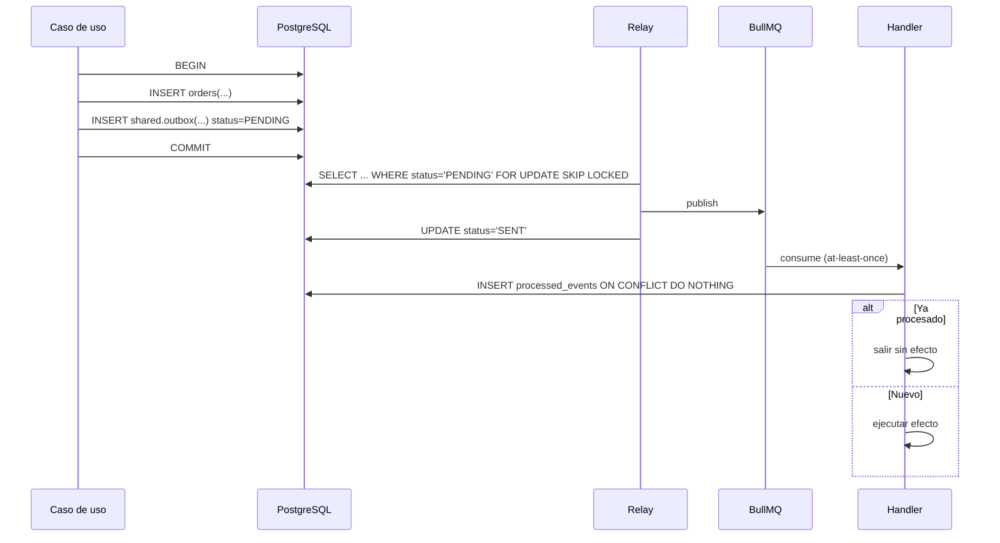

# RFC-0013 — Eventos de dominio e integración

| Campo             | Valor                                                   |
| ----------------- | ------------------------------------------------------- |
| **Estado**        | Aprobado · **Autor** Arquitecto · **Creado** 2026-08-06 |
| **Revisores**     | Backend · Base de Datos · DevOps · Observabilidad       |
| **ADR generados** | ADR-0007, ADR-0014                                      |
| **Bloque**        | A (A12, A13) · Sprint 0                                 |

---

## 1. Problema

Los módulos deben comunicarse sin acoplarse. Los eventos lo permiten, pero introducen dos
clases de bug que hay que eliminar por diseño, no por disciplina:

1. **Pérdida o desincronización**: el cambio se guarda y el evento no se publica (o al
   revés).
2. **Duplicación de efectos**: la cola reintrega y el handler vuelve a ejecutar su efecto.

Además, este mecanismo es lo que habilita CRM, Inventario y Analítica en fases futuras sin
tocar los módulos de Fase 1.

## 2. Objetivos y no-objetivos

**Objetivos:** atomicidad entre cambio y evento · idempotencia de todo consumidor ·
esquemas versionados · reintentos con DLQ · trazabilidad de punta a punta ·
que añadir un consumidor no requiera tocar al emisor.

**No-objetivos:** event sourcing · broker externo (Kafka, RabbitMQ) en Fase 1 ·
entrega exactamente-una-vez (no existe; se logra idempotencia).

## 3. Alternativas consideradas

**Atomicidad**

| Alternativa                          | Descarte                                                                                                                                 |
| ------------------------------------ | ---------------------------------------------------------------------------------------------------------------------------------------- |
| A. Publicar dentro de la transacción | La cola no participa en la transacción de PostgreSQL: si la publicación falla, se revierte el negocio por un problema de infraestructura |
| B. Publicar tras el commit           | Si el proceso muere entre el commit y la publicación, el evento se pierde para siempre                                                   |
| **C. Outbox transaccional + relay**  | **Elegida.** El evento se escribe en la misma transacción; un relay lo publica después, con reintento                                    |

**Transporte**

| Alternativa               | Descarte                                                                                                       |
| ------------------------- | -------------------------------------------------------------------------------------------------------------- |
| A. Kafka                  | Infraestructura pesada para el volumen de la Fase 1                                                            |
| **B. BullMQ sobre Redis** | **Elegida.** Redis ya está en el stack; reintentos, DLQ y prioridades incluidos; sustituible detrás del puerto |

## 4. Diseño

### 4.1 Flujo



### 4.2 Formato del evento

```json
{
  "eventId": "01924f8a-...",
  "type": "orders.OrderPlaced.v1",
  "occurredAt": "2026-08-06T14:30:00.000Z",
  "correlationId": "req-abc123",
  "tenantId": "eusse",
  "payload": {}
}
```

Campos obligatorios: `eventId` (UUID v7, clave de deduplicación) · `type` (con versión) ·
`occurredAt` (UTC) · `correlationId` · `tenantId` · `payload`.

**El payload es autocontenido.** Si el consumidor necesita consultar al emisor para
entenderlo, el acoplamiento vuelve por la puerta de atrás.

### 4.3 Nomenclatura

`<contexto>.<Agregado><VerboEnPasado>.v<N>`

`orders.OrderPlaced.v1` · `identity.UserRegistered.v1` · `pricing.VariantPriceChanged.v1`

Siempre en **pasado**: describe un hecho ocurrido, no una orden de hacer algo.
`SendWelcomeEmail` sería un comando disfrazado y acoplaría emisor y consumidor.

### 4.4 Catálogo de eventos de Fase 1

| Evento                                   | Emisor   | Consumidores (fase)                              |
| ---------------------------------------- | -------- | ------------------------------------------------ |
| `identity.UserRegistered.v1`             | Identity | Notifications, CRM(3)                            |
| `identity.EmailVerificationRequested.v1` | Identity | Notifications                                    |
| `identity.PasswordResetRequested.v1`     | Identity | Notifications                                    |
| `identity.PasswordChanged.v1`            | Identity | Notifications                                    |
| `accounts.AccountApproved.v1`            | Accounts | Notifications, Pricing, CRM(3)                   |
| `accounts.AccountRejected.v1`            | Accounts | Notifications                                    |
| `catalog.ProductPublished.v1`            | Catalog  | Search, ISR, Analytics(2)                        |
| `pricing.VariantPriceChanged.v1`         | Pricing  | Cart, Notifications                              |
| `cart.ItemAdded.v1`                      | Cart     | Analytics(2)                                     |
| `cart.CartAbandoned.v1`                  | Cart     | Notifications, CRM(3)                            |
| `orders.OrderPlaced.v1`                  | Orders   | Notifications, Inventory(2), Payments(2), CRM(3) |
| `orders.OrderApproved.v1`                | Orders   | Notifications                                    |
| `orders.OrderCancelled.v1`               | Orders   | Notifications, Inventory(2), Payments(2)         |
| `orders.OrderShipped.v1`                 | Orders   | Notifications, Tracking(2)                       |
| `content.LeadCaptured.v1`                | Content  | Notifications, CRM(3)                            |

Los tres eventos de Identity se añadieron al implementar B4: el correo de verificación, el
de recuperación y el aviso de cambio de contraseña salen por outbox como cualquier otro
efecto, para que no exista el caso "usuario creado, correo nunca enviado".

**Payload con secreto — resuelto.** `EmailVerificationRequested` y `PasswordResetRequested`
llevan el token **en claro** en el payload, porque el consumidor lo necesita para componer
el enlace. Dejarlo ahí contradiría la regla de RFC-0003 §4.9 de guardar sólo el hash, así
que el relay **borra el payload en el mismo `UPDATE` que marca la fila como `SENT`**. La
fila se conserva —es la traza de que el evento existió y se publicó— con
`payload = {"redacted": true}`. El reintento no se ve afectado: lo hace BullMQ desde el
mensaje ya encolado, no releyendo el outbox.

La lista vive en `apps/workers/src/shared/sensitive-events.ts` y tiene test. **Añadir un
evento con un secreto en el payload sin añadirlo a esa lista es un fallo de seguridad.**

### 4.5 Versionado

| Cambio                           | Compatible | Acción     |
| -------------------------------- | ---------- | ---------- |
| Añadir campo opcional al payload | Sí         | Mismo `v1` |
| Quitar o renombrar campo         | No         | `v2`       |
| Cambiar tipo o semántica         | No         | `v2`       |

Durante la migración se publican `v1` y `v2` simultáneamente hasta que todos los
consumidores migren. Los esquemas de payload viven en `@eusse/contracts` y se validan al
publicar **y** al consumir.

### 4.6 Colas y política de reintento

Colas por dominio de trabajo: `outbox-relay` · `notifications` · `search-index` ·
`reports` · `cleanup`.

Reintento exponencial con jitter (1 s, 4 s, 16 s, 64 s, 256 s), 5 intentos, luego DLQ con
el error completo. Alerta si la DLQ crece o si el outbox acumula pendientes de más de
5 minutos. Runbook de reproceso documentado antes de publicar el primer evento en producción.

### 4.7 Observabilidad

`correlationId` propagado desde el borde hasta el handler y hasta el tercero.
Métricas: eventos publicados, consumidos, fallidos y en DLQ, por tipo. Latencia del outbox
(tiempo entre `occurredAt` y publicación).

## 5. Impacto

Base de la comunicación entre módulos. Toda escritura relevante emite un evento. Requiere
tablas `shared.outbox` y `shared.processed_events` desde el Bloque A.

## 6. Riesgos

| Riesgo                             | Prob. | Impacto | Mitigación                                                             |
| ---------------------------------- | ----- | ------- | ---------------------------------------------------------------------- |
| Evento perdido (R-08)              | Media | Alto    | Outbox + relay con reintento + alerta de pendientes                    |
| Efecto duplicado (R-08)            | Alta  | Alto    | `processed_events` + test de entrega doble por handler                 |
| Handler que asume orden de llegada | Alta  | Medio   | Regla explícita + test con eventos desordenados                        |
| Cadenas de eventos profundas       | Media | Medio   | Máximo 2 saltos; más de eso requiere revisión del Arquitecto           |
| Payload que crece sin control      | Media | Bajo    | Límite de 64 KB por evento; lo mayor va por referencia a `StoragePort` |

## 7. Criterios de aceptación

```gherkin
Escenario: Atomicidad entre cambio y evento
  Dado un caso de uso que crea una orden y emite OrderPlaced
  Cuando la transacción falla
  Entonces ni la orden ni el evento existen

Escenario: Idempotencia del consumidor
  Dado un handler que ya procesó el evento con eventId X
  Cuando recibe el mismo eventId de nuevo
  Entonces no produce ningún efecto adicional
  Y responde con éxito

Escenario: Tolerancia al desorden
  Dado un handler de estados de envío
  Cuando recibe un evento anterior al último procesado
  Entonces lo ignora y registra la anomalía

Escenario: Mensaje envenenado va a DLQ
  Dado un evento que falla en los 5 intentos
  Entonces acaba en la DLQ con el error completo
  Y se emite una alerta
  Y la cola sigue procesando los siguientes
```

## 8. Plan de implementación

A12 (workers y BullMQ) y A13 (outbox, relay, deduplicación) del Bloque A.
**Puerta A incluye un evento fluyendo de punta a punta.**

## 9. Preparación para fases futuras

**Hueco:** el transporte está tras un puerto → migrar a Kafka o similar es cambiar el
adaptador · los eventos de Fase 1 ya publican lo que CRM, Inventario y Analítica
consumirán en fases posteriores: enchufar un consumidor nuevo no toca al emisor.
**No se construye:** event sourcing, broker externo, replay histórico.

## 10. Preguntas abiertas

Ninguna bloqueante.

## 11. Enlaces

[ADR-0014](../adrs/ADR-0014-transactional-outbox.md) ·
[`skills/events-messaging.md`](../skills/events-messaging.md) ·
[`templates/event.md`](../templates/event.md)
