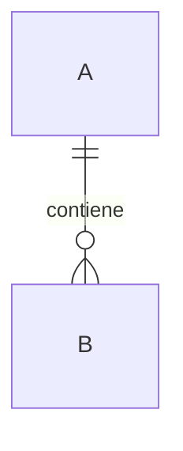
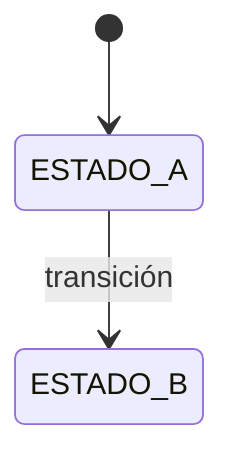

# Modelo de dominio — <Contexto acotado>

**Dueño:** <agente> · **RFC:** RFC-XXXX · **Última revisión:** AAAA-MM-DD · **Estado:** Vigente

## 1. Propósito

Qué responsabilidad tiene este contexto.

**Qué NO hace** (igual de importante):

- …

## 2. Lenguaje ubicuo

| Término | Significado exacto en este contexto | No confundir con |
| ------- | ----------------------------------- | ---------------- |
|         |                                     |                  |

Términos que significan algo distinto en otro contexto: declararlo explícitamente.

## 3. Agregados

### `<AgregadoRaíz>`

**Invariantes** (cada uno con test unitario):

| ID     | Invariante |
| ------ | ---------- |
| INV-01 |            |

**Entidades internas:** …
**Value objects:** …
**Referencias a otros agregados:** por ID, nunca por objeto.

## 4. Casos de uso

| ID     | Nombre | Tipo               | Actor |
| ------ | ------ | ------------------ | ----- |
| CU-001 |        | Comando / Consulta |       |

Detalle de cada uno en [`templates/use-case.md`](use-case.md).

## 5. Máquinas de estado

Toda transición no representada lanza `<CONTEXT>_INVALID_TRANSITION`.

## 6. Eventos

**Emite**

| Evento            | Cuándo | Payload | Consumidores |
| ----------------- | ------ | ------- | ------------ |
| `<ctx>.XxxYyy.v1` |        |         |              |

**Consume**

| Evento | Efecto | Idempotente por |
| ------ | ------ | --------------- |
|        |        | `eventId`       |

## 7. Errores

| Código | HTTP | Cuándo |
| ------ | ---- | ------ |
|        |      |        |

## 8. Puertos

| Puerto | Para qué | Adaptador F1 | Adaptador futuro |
| ------ | -------- | ------------ | ---------------- |
|        |          |              |                  |

## 9. Persistencia

**Esquema PostgreSQL:** `<nombre>`

| Tabla | Propósito | Índices y su motivo |
| ----- | --------- | ------------------- |
|       |           |                     |

Mapeo agregado ↔ tablas. Referencias a otros contextos: sólo por ID, **sin FK**.

## 10. Dependencias

| Depende de | Tipo                          | Qué usa |
| ---------- | ----------------------------- | ------- |
|            | Síncrona (`public/`) / Evento |         |

## 11. Preparación para fases futuras

**Hueco que se deja:** …
**Lo que explícitamente NO se construye ahora:** …
